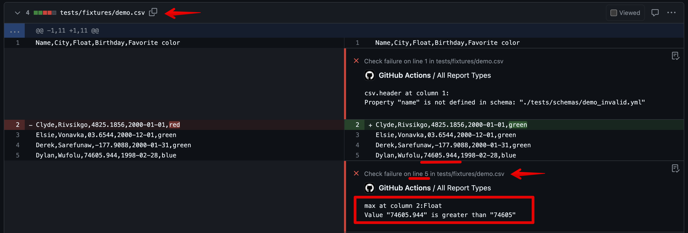
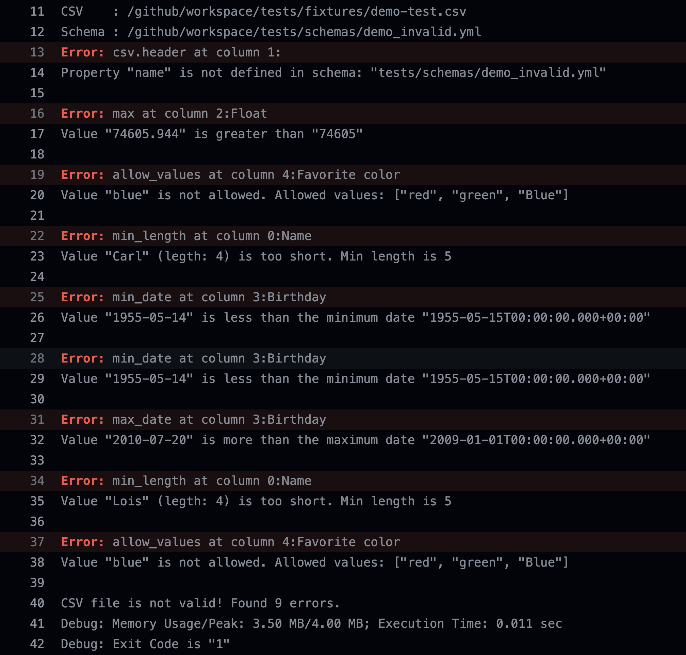

# JBZoo / CSV Blueprint

<!-- auto-update:top-badges -->
[](https://github.com/JBZoo/Csv-Blueprint/actions/workflows/main.yml?query=branch%3Amaster)
[](https://github.com/JBZoo/Csv-Blueprint/actions/workflows/demo.yml)
[](https://coveralls.io/github/JBZoo/Csv-Blueprint?branch=master)
[](https://shepherd.dev/github/JBZoo/Csv-Blueprint)
[](https://github.com/jbzoo/csv-blueprint/releases)
[](https://packagist.org/packages/jbzoo/csv-blueprint/stats)
[](https://hub.docker.com/r/jbzoo/csv-blueprint/tags)
<!-- auto-update:/top-badges -->

<!-- auto-update:rules-counter -->
[](schema-examples/full.yml)
[](src/Rules/Cell)
[](src/Rules/Aggregate)
[](#extra-checks)
[](tests/schemas/todo.yml)
<!-- auto-update:/rules-counter -->

A console utility designed for validating CSV files against a strictly defined schema and validation rules outlined
in [YAML files](#schema-definition) serves an essential purpose in ensuring data integrity and conformity.
This utility facilitates automated checks to verify that the structure and content of CSV files adhere to predefined
specifications, making it invaluable in scenarios where data quality and consistency are critical.


<!-- auto-update:toc -->
- [Introduction](#introduction)
- [Usage](#usage)
- [Schema definition](#schema-definition)
- [Presets and reusable schemas](#presets-and-reusable-schemas)
- [Complete CLI help message](#complete-cli-help-message)
- [Report examples](#report-examples)
- [Benchmarks](#benchmarks)
- [Disadvantages?](#disadvantages)
- [Coming soon](#coming-soon)
- [Contributing](#contributing)
- [License](#license)
- [See also](#see-also)
<!-- auto-update:/toc -->


## Introduction

### Why?

* **Data Integration:** Ensures incoming CSV files from multiple sources meet the expected formats and data types,
  facilitating smoother data integration.
* **Automated Data Pipelines:** Validates CSV files against a predefined schema in automated ETL processes, reducing the
  risk of errors and enhancing data quality in downstream applications.
* **Data Quality Assurance:** Improves data quality before it enters analysis workflows or databases, saving time and
  resources.
* **Development and Testing:** Aids in software development, especially for applications dealing with CSV data
  import/export, by validating test data for consistency and reliability.
* **Collaboration Across Teams:** Allows teams to define and share CSV formats and validation rules through YAML files,
  promoting data specification consistency organization-wide. Emphasizes the principle of "documentation as code."

### Features

* **Schema-based Validation:** Allows the definition of CSV file structure and rules in an intuitive YAML format,
  enabling precise validation against the expected data format. [YAML Format Example](schema-examples/full.yml).
* **Comprehensive Rule Set:** Offers a wide range of validation rules, including non-empty fields, exact values, regular
  expressions, numeric constraints, date formats, and more, to meet diverse data validation requirements.
* **Docker Support:** Facilitates easy integration into any workflow with Docker support, ensuring a seamless experience
  across development, testing, and production environments.
* **GitHub Actions Integration:** Enables CSV validation automation within CI/CD pipelines to improve data quality
  control in pull requests and deployments.
* **Flexible Reporting:** Offers integration capabilities with GitHub, Gitlab, TeamCity, and more. Outputs include a
  human-readable table for ease of understanding. [View Live Demo](https://github.com/JBZoo/Csv-Blueprint-Demo).


<details>
  <summary>CLICK to see typical workflow</summary>

1. **Data Preparation:** Team A generates CSV data adhering to a predefined format and places the file in a shared
   location accessible to Team B (e.g., a shared repository or cloud storage).

2. **Notification:** Team A notifies Team B that the data is ready via corporate communication channels (email, chat,
   task management system).

3. **Validation:** Team B uses predefined validation rules stored in the repository to check the CSV file for accuracy
   and integrity before importing. This includes verifying date formats, numerical values, and the presence of required
   columns.

4. **Data Import:** After successful validation, Team B imports the data from the CSV file into their system for further
   processing.

5. **Error Handling:** If validation identifies errors, the process halts, and Team B provides feedback to Team A for
   data correction.

**Why Validation is Necessary:**

- **Reduce Errors:** Validating data before import minimizes the likelihood of errors, enhancing data quality.
- **Efficiency:** Prevents time loss on manual error correction post-import.
- **Data Consistency:** Ensures data meets the expectations and requirements of Team B, facilitating accurate processing
  and analysis.
- **Automation:** Storing validation rules in the repository eases the process of checking automation and simplifies
  updating validation criteria.

</details>


### Live demo

As a live demonstration of how the tool works, you can explore the super minimal repository
at [JBZoo/Csv-Blueprint-Demo](https://github.com/JBZoo/Csv-Blueprint-Demo). You're encouraged to fork it and experiment
with the tool.

For more complex examples and various reporting methods, take a look at
the [last Demo pipeline](https://github.com/JBZoo/Csv-Blueprint/actions/workflows/demo.yml). Opening the logs will
reveal basic starting points. Additionally, the `All Report Types` link (located in the left sidebar) provides access to
different types of reports.

**See also**
* [PR as a live demo](https://github.com/JBZoo/Csv-Blueprint-Demo/pull/1/files)
* [.github/workflows/demo.yml](.github/workflows/demo.yml)
* [demo_invalid.yml](tests/schemas/demo_invalid.yml)
* [demo_valid.yml](tests/schemas/demo_valid.yml)
* [demo.csv](tests/fixtures/demo.csv)

## Usage

You can find launch examples in the [workflow demo](https://github.com/JBZoo/Csv-Blueprint/actions/workflows/demo.yml).

### GitHub Action

<!-- auto-update:github-actions-yml -->
```yml
- uses: jbzoo/csv-blueprint@master # See the specific version on releases page. `@master` is latest.
  with:
    # Specify the path(s) to the CSV files you want to validate.
    #   This can include a direct path to a file or a directory to search with a maximum depth of 10 levels.
    #   Examples: p/file.csv; p/*.csv; p/**/*.csv; p/**/name-*.csv; **/*.csv
    csv: './tests/**/*.csv'

    # Specify the path(s) to the schema file(s), supporting YAML, JSON, or PHP formats.
    #   Similar to CSV paths, you can direct to specific files or search directories with glob patterns.
    #   Examples: p/file.yml; p/*.yml; p/**/*.yml; p/**/name-*.yml; **/*.yml
    schema: './tests/**/*.yml'

    # Report format. Available options: text, table, github, gitlab, teamcity, junit.
    # Default value: 'table'
    report: 'table'

    # Apply all schemas (also without `filename_pattern`) to all CSV files found as global rules.
    #   Available options:
    #   auto: If no glob pattern (*) is used for --schema, the schema is applied to all found CSV files.
    #   yes: Apply all schemas to all CSV files, Schemas without `filename_pattern` are applied as a global rule.
    #   no: Apply only schemas with not empty `filename_pattern` and match the CSV files.
    # Default value: 'auto'
    apply-all: 'auto'

    # Quick mode. It will not validate all rows. It will stop after the first error.
    # Default value: 'no'
    quick: 'no'

    # Skip schema validation. If you are sure that the schema is correct, you can skip this check.
    # Default value: 'no'
    skip-schema: 'no'

    # Extra options for the CSV Blueprint. Only for debbuging and profiling.
    # Available options:
    #   ANSI output. You can disable ANSI colors if you want with `--no-ansi`.
    #   Verbosity level: Available options: `-v`, `-vv`, `-vvv`.
    #   Add flag `--profile` if you want to see profiling info. Add details with `-vvv`.
    #   Add flag `--debug` if you want to see more really deep details.
    #   Add flag `--dump-schema` if you want to see the final schema after all includes and inheritance.
    # Default value: 'options: --ansi -v'
    # You can skip it.
    extra: 'options: --ansi -v'
```
<!-- auto-update:/github-actions-yml -->

### Docker container

Ensure you have Docker installed on your machine.

```sh
# Pull the Docker image
docker pull jbzoo/csv-blueprint:latest

# Run the tool inside Docker
docker run --rm                                  \
    --workdir=/parent-host                       \
    -v $(pwd):/parent-host                       \
    jbzoo/csv-blueprint:latest                   \
    validate:csv                                 \
    --csv=./tests/fixtures/demo.csv              \
    --schema=./tests/schemas/demo_invalid.yml    \
    --ansi -vvv

# OR build it from source.
git clone git@github.com:JBZoo/Csv-Blueprint.git csv-blueprint
cd csv-blueprint
make docker-build  # local tag is "jbzoo/csv-blueprint:local"
```

### Phar binary

<details>
  <summary>CLICK to see using PHAR file</summary>

Ensure you have PHP installed on your machine.

```sh
# Just download the latest version
wget https://github.com/JBZoo/Csv-Blueprint/releases/latest/download/csv-blueprint.phar
chmod +x ./csv-blueprint.phar
./csv-blueprint.phar validate:csv               \
   --csv=./tests/fixtures/demo.csv              \
   --schema=./tests/schemas/demo_invalid.yml

# OR create project via Composer (--no-dev is optional)
composer create-project --no-dev jbzoo/csv-blueprint
cd ./csv-blueprint
./csv-blueprint validate:csv                    \
    --csv=./tests/fixtures/demo.csv             \
    --schema=./tests/schemas/demo_invalid.yml

# OR build from source
git clone git@github.com:jbzoo/csv-blueprint.git csv-blueprint
cd csv-blueprint 
make build
./csv-blueprint validate:csv                    \
    --csv=./tests/fixtures/demo.csv             \
    --schema=./tests/schemas/demo_invalid.yml
```

</details>

## Schema definition

Define your CSV validation schema in YAML for clear and structured configuration. Alternative formats are also
supported: [JSON](schema-examples/full.json) and [PHP](schema-examples/full.php), accommodating various preferences and
workflow requirements.

The provided example illustrates a straightforward schema for a CSV file with a header row. It mandates that the `id`
column must not be empty and should only contain integer values. Additionally, the `name` column is required to have a
minimum length of 3 characters, ensuring basic data integrity and usefulness.

### Example schema in YAML

<!-- auto-update:readme-sample-yml -->
```yml
name: Simple CSV Schema
filename_pattern: /my-favorite-csv-\d+\.csv$/i
csv:
  delimiter: ';'

columns:
  - name: id
    rules:
      not_empty: true
      is_int: true
    aggregate_rules:
      is_unique: true
      sorted: [ asc, numeric ]

  - name: name
    rules:
      length_min: 3
    aggregate_rules:
      count: 10
```
<!-- auto-update:/readme-sample-yml -->


### Full schema description

In the [example YAML file](schema-examples/full.yml), a detailed description of all features is provided. This
documentation is verified through automated tests, ensuring it remains current.

**Important Notes:**

- The traditional typing of columns (e.g., `type: integer`) has been intentionally omitted in favor of rules. These
  rules can be sequenced and combined freely, offering extensive flexibility for CSV file validation.
- All options are optional unless stated otherwise. You have the liberty to include or omit them as you see fit.
- Specifying an incorrect rule name, using non-existent values (not listed below), or assigning an incompatible variable
  type for any option will result in a schema validation error. To bypass these errors, you may opt to use
  the `--skip-schema` flag at your discretion, allowing the use of your custom keys in the schema.
- The rule `not_empty` is the sole exception; it does not ignore empty strings (length 0). To enforce a non-empty value,
  apply `not_empty: true`. Note that a single space (` `) counts as a character, making the string length `1`. To
  prevent such scenarios, include `is_trimmed: true`.
- Rules operate independently; they have no knowledge of or influence over one another.
- You are free to combine rules in any manner or opt not to use them at all. They are grouped below for easier
  navigation and understanding.
- When a rule's value is `is_some_rule: true`, it merely serves as an activation toggle. Other values represent rule
  parameters.
- The sequence of rule execution follows their order in the schema, affecting only the order of error messages in the
  report.
- Unless explicitly stated, most rules are case-sensitive.
- As a fallback, the `regex` rule is available. However, using clear rule combinations is recommended for greater
  clarity on validation errors.

Below is a comprehensive list of rules, each accompanied by a brief explanation and example for clarity. This section is
also validated through automated tests, ensuring the information is consistently accurate.

In any unclear situation, look into it first ;)

<!-- auto-update:full-yml -->
```yml
# It's a complete example of the CSV schema file in YAML format.
# See copy of the file without comments here ./schema-examples/full_clean.yml

# Just meta
name: CSV Blueprint Schema Example      # Name of a CSV file. Not used in the validation process.
description: |                          # Any description of the CSV file. Not used in the validation process.
  This YAML file provides a detailed description and validation rules for CSV files
  to be processed by CSV Blueprint tool. It includes specifications for file name patterns,
  CSV formatting options, and extensive validation criteria for individual columns and their values,
  supporting a wide range of data validation rules from basic type checks to complex regex validations.
  This example serves as a comprehensive guide for creating robust CSV file validations.

presets:                                # Include another schema and define an alias for it.
  my-preset: ./preset_users.yml         # Define preset alias "my-preset". See README.md for details.

# Regular expression to match the file name. If not set, then no pattern check.
# This allows you to pre-validate the file name before processing its contents.
# Feel free to check parent directories as well.
# See: https://www.php.net/manual/en/reference.pcre.pattern.syntax.php
filename_pattern: /demo(-\d+)?\.csv$/i
#  preset: my-preset                    # See README.md for details.

# Here are default values to parse CSV file.
# You can skip this section if you don't need to override the default values.
csv:
  preset: my-preset                     # See README.md for details.
  header: true                          # If the first row is a header. If true, name of each column is required.
  delimiter: ,                          # Delimiter character in CSV file.
  quote_char: \                         # Quote character in CSV file.
  enclosure: '"'                        # Enclosure for each field in CSV file.
  encoding: utf-8                       # (Experimental) Only utf-8, utf-16, utf-32.
  bom: false                            # (Experimental) If the file has a BOM (Byte Order Mark) at the beginning.

# Structural rules for the CSV file. These rules are applied to the entire CSV file.
# They are not(!) related to the data in the columns.
# You can skip this section if you don't need to override the default values.
structural_rules: # Here are default values.
  preset: my-preset                     # See README.md for details.
  strict_column_order: true             # Ensure columns in CSV follow the same order as defined in this YML schema. It works only if "csv.header" is true.
  allow_extra_columns: false            # Allow CSV files to have more columns than specified in this YML schema.

# Description of each column in CSV.
# It is recommended to present each column in the same order as presented in the CSV file.
# This will not affect the validator, but will make it easier for you to navigate.
# For convenience, use the first line as a header (if possible).
columns:
  - preset: my-preset/login             # Add preset rules for the column. See README.md for details.
    name: Column Name (header)          # Any custom name of the column in the CSV file (first row). Required if "csv.header" is true.
    description: Lorem ipsum            # Description of the column. Not used in the validation process.
    example: Some example               # Example of the column value. Schema will also check this value on its own.

    # If the column is required. If true, the column must be present in the CSV file. If false, the column can be missing in the CSV file.
    # So, if you want to make the column optional, set this value to false, and it will validate the column only if it is present.
    # By default, the column is required. It works only if "csv.header" is true and "structural_rules.allow_extra_columns" is false.
    required: true

    ####################################################################################################################
    # Data validation for each(!) value in the column. Please, see notes in README.md
    # Every rule is optional.
    rules:
      preset: my-preset/login           # Add preset rules for the column. See README.md for details.

      # General rules
      not_empty: true                   # Value is not an empty string. Actually checks if the string length is not 0.
      exact_value: Some string          # Exact value for string in the column.
      allow_values: [ y, n, "" ]        # Strict set of values that are allowed.
      not_allow_values: [ invalid ]     # Strict set of values that are NOT allowed.

      # Any valid regex pattern. See: https://www.php.net/manual/en/reference.pcre.pattern.syntax.php
      # Of course it's a super powerful tool to verify any sort of string data.
      # Please, be careful. Regex is a powerful tool, but it can be very dangerous if used incorrectly.
      # Remember that if you want to solve a problem with regex, you now have two problems.
      # But have it your way, then happy debugging! https://regex101.com
      regex: /^[\d]{2}$/

      # Checks length of a string including spaces (multibyte safe).
      length_min: 1                     # x >= 1
      length_greater: 2                 # x >  2
      length_not: 0                     # x != 0
      length: 7                         # x == 7
      length_less: 8                    # x <  8
      length_max: 9                     # x <= 9

      # Basic string checks
      is_trimmed: true                  # Only trimmed strings. Example: "Hello World" (not " Hello World ").
      is_lowercase: true                # String is only lower-case. Example: "hello world".
      is_uppercase: true                # String is only upper-case. Example: "HELLO WORLD".
      is_capitalize: true               # String is only capitalized. Example: "Hello World".

      # Count number of words used in a string
      # Note that multibyte locales are not supported.
      # Example: "Hello World, 123" - 2 words only (123 is not a word).
      word_count_min: 1                 # x >= 1
      word_count_greater: 2             # x >  2
      word_count_not: 0                 # x != 0
      word_count: 7                     # x == 7
      word_count_less: 8                # x <  8
      word_count_max: 9                 # x <= 9

      # Contains rules
      contains: World                   # Example: "Hello World!". The string must contain "World" in any place.
      contains_none: [ a, b ]           # All the strings must NOT be part of a CSV value.
      contains_one: [ a, b ]            # Only one of the strings must be part of the CSV value.
      contains_any: [ a, b ]            # At least one of the string must be part of the CSV value.
      contains_all: [ a, b ]            # All the strings must be part of a CSV value.
      starts_with: 'prefix '            # Example: "prefix Hello World".
      ends_with: ' suffix'              # Example: "Hello World suffix".

      # Under the hood it converts and compares as float values.
      # Comparison accuracy is 10 digits after a dot.
      # Scientific number format is also supported. Example: "1.2e3"
      num_min: 1.0                      # x >= 1.0
      num_greater: 2.0                  # x >  2.0
      num_not: 5.0                      # x != 5.0
      num: 7.0                          # x == 7.0
      num_less: 8.0                     # x <  8.0
      num_max: 9.0                      # x <= 9.0
      is_int: true                      # Check format only. Can be negative and positive. Without any separators.
      is_float: true                    # Check format only. Can be negative and positive. Dot as decimal separator.

      # Number of digits after the decimal point (with zeros)
      precision_min: 1                  # x >= 1
      precision_greater: 2              # x >  2
      precision_not: 0                  # x != 0
      precision: 7                      # x == 7
      precision_less: 8                 # x <  8
      precision_max: 9                  # x <= 9

      # Dates. Under the hood, the strings are converted to timestamp and compared.
      # This gives you the ability to use relative dates and any formatting you want.
      # By default, it works in UTC. But you can specify your own timezone as part of the date string.
      # Format:    https://www.php.net/manual/en/datetime.format.php
      # Parsing:   https://www.php.net/manual/en/function.strtotime.php
      # Timezones: https://www.php.net/manual/en/timezones.php
      date_min: -100 years              # Example of relative formats
      date_greater: -99 days            # Example of relative formats
      date_not: 2006-01-02 15:04:05 -0700 Europe/Rome
      date: 01 Jan 2000                 # You can use any string that can be parsed by the strtotime function
      date_less: now                    # Example of current date and time
      date_max: +1 day                  # Example of relative formats
      date_format: Y-m-d                # Check strict format of the date.
      is_date: true                     # Accepts arbitrary date format. Is shows error if failed to convert to timestamp.
      is_timezone: true                 # Allow only timezone identifiers. Case-insensitive. Example: "Europe/London", "utc".
      is_timezone_offset: true          # Allow only timezone offsets. Example: "+03:00".
      is_time: true                     # Check if the cell value is a valid time in the format "HH:MM:SS AM/PM" / "HH:MM:SS" / "HH:MM". Case-insensitive.
      is_leap_year: true                # Check if the cell value is a leap year. Example: "2008", "2008-02-29 23:59:59 UTC".

      # Date Intervals. Under the hood, the strings are converted to seconds and compared.
      # See: https://www.php.net/manual/en/class.dateinterval.php
      # See: https://www.php.net/manual/en/dateinterval.createfromdatestring.php
      date_interval_min: PT0S           # 0 seconds
      date_interval_greater: 1day 1sec  # 1 day and 1 second
      date_interval_not: 100 days       # Except for the 100 days
      date_interval: P2W                # Exactly 2 weeks
      date_interval_less: PT23H59M59S   # 23 hours, 59 minutes, and 59 seconds
      date_interval_max: P1Y            # 1 year

      # Check an arbitrary date in a CSV cell for age (years).
      # Actually it calculates the difference between the date and the current date.
      # Convenient to use for age restrictions based on birthday.
      # See the description of `date_*` functions for details on date formats.
      date_age_min: 1                   # x >= 1
      date_age_greater: 14              # x >  14
      date_age_not: 18                  # x != 18
      date_age: 21                      # x == 21
      date_age_less: 99                 # x <  99
      date_age_max: 100                 # x <= 100

      # Specific formats
      is_bool: true                     # Allow only boolean values "true" and "false", case-insensitive.
      is_binary: true                   # Both: with or without "0b" prefix. Example: "0b10" or "10"
      is_octal: true                    # Validates octal numbers in the format "0o123" or "0123".
      is_hex: true                      # Both: with or without "0x" prefix. Example: "0x1A" or "1A"
      is_uuid: true                     # Validates whether the input is a valid UUID. It also supports validation of specific versions 1, 3, 4 and 5.
      is_slug: true                     # Only slug format. Example: "my-slug-123". It can contain letters, numbers, and dashes.
      is_currency_code: true            # Validates an ISO 4217 currency code like GBP or EUR. Case-sensitive. See: https://en.wikipedia.org/wiki/ISO_4217.
      is_base64: true                   # Validate if a string is Base64-encoded. Example: "cmVzcGVjdCE=".
      is_angle: true                    # Check if the cell value is a valid angle (0.0 to 360.0).

      # Safity checks
      # Password strength calculation criteria include: Length (max 5 points, +1 every 2 characters),
      # presence of uppercase letters (+1), lowercase letters (+1), numbers (+1), special characters (+1),
      # spaces (+1), and penalties for consecutive sequences of uppercase, lowercase, or
      # numbers (-0.5 each), repetitive sequences (-0.75 each), common weak passwords like "qwerty",
      # and passwords under 6 characters (-2). Adjust scores to a 0 to 10 scale, with a minimum score of 0.
      password_strength_min: 1          # x >= 1
      password_strength_greater: 2      # x >  2
      password_strength_not: 0          # x != 0
      password_strength: 7              # x == 7
      password_strength_less: 8         # x <  8
      password_strength_max: 9          # x <= 9
      is_password_safe_chars: true      # Check that the cell value contains only safe characters for regular passwords. Allowed characters: a-z, A-Z, 0-9, !@#$%^&*()_+-=[]{};:'"|,.<>/?~.

      # Internet
      is_ip: true                       # Both: IPv4 or IPv6.
      is_ip_v4: true                    # Only IPv4. Example: "127.0.0.1".
      is_ip_v6: true                    # Only IPv6. Example: "2001:0db8:85a3:08d3:1319:8a2e:0370:7334".
      is_ip_private: true               # IPv4 has ranges: 10.0.0.0/8, 172.16.0.0/12 and 192.168.0.0/16. IPv6 has ranges starting with FD or FC.
      is_ip_reserved: true              # IPv4 has ranges: 0.0.0.0/8, 169.254.0.0/16, 127.0.0.0/8 and 240.0.0.0/4. IPv6 has ranges: ::1/128, ::/128, ::ffff:0:0/96 and fe80::/10.
      ip_v4_range: [ '127.0.0.1-127.0.0.5', '127.0.0.0/21' ] # Check subnet mask or range for IPv4. Address must be in one of the ranges.
      is_mac_address: true              # The input is a valid MAC address. Example: 00:00:5e:00:53:01
      is_domain: true                   # Only domain name. Example: "example.com".
      is_public_domain_suffix: true     # The input is a public ICANN domain suffix. Example: "com", "nom.br", "net" etc.
      is_url: true                      # Only URL format. Example: "https://example.com/page?query=string#anchor".
      is_email: true                    # Only email format. Example: "user@example.com".

      # Validates if the given input is a valid JSON.
      # This is possible if you escape all special characters correctly and use a special CSV format.
      is_json: true                     # Example: {"foo":"bar"}.

      # Geography
      is_latitude: true                 # Can be integer or float. Example: 50.123456.
      is_longitude: true                # Can be integer or float. Example: -89.123456.
      is_geohash: true                  # Check if the value is a valid geohash. Example: "u4pruydqqvj".
      is_cardinal_direction: true       # Valid cardinal direction. Available values: ["N", "S", "E", "W", "NE", "SE", "NW", "SW", "none", ""]
      is_usa_market_name: true          # Check if the value is a valid USA market name. Example: "New York, NY".

      # Validates whether the input is a country code in ISO 3166-1 standard.
      # Available options: "alpha-2" (Ex: "US"), "alpha-3" (Ex: "USA"), "numeric" (Ex: "840").
      # The rule uses data from iso-codes: https://salsa.debian.org/iso-codes-team/iso-codes.
      is_country_code: alpha-2          # Country code in ISO 3166-1 standard. Examples: "US", "USA", "840"

      # Validates whether the input is language code based on ISO 639.
      # Available options: "alpha-2" (Ex: "en"), "alpha-3" (Ex: "eng").
      # See: https://en.wikipedia.org/wiki/ISO_639.
      is_language_code: alpha-2         # Examples: "en", "eng"

      # Filesystem (with IO!)
      is_file_exists: true              # Check if file exists on the filesystem (It's FS IO operation!).
      is_dir_exists: true               # Check if directory exists on the filesystem (It's FS IO operation!).

      # Mathematical
      is_fibonacci: true                # Validates whether the input follows the Fibonacci integer sequence. Example: "8", "13".
      is_prime_number: true             # Validates a prime number. Example: "3", "5", "7", "11".
      is_even: true                     # Check if the value is an even number. Example: "2", "4", "6".
      is_odd: true                      # Check if the value is an odd number. Example: "1", "7", "11".
      is_roman: true                    # Validates if the input is a Roman numeral. Example: "I", "IV", "XX".
      is_luhn: true                     # Luhn algorithm. See: https://en.wikipedia.org/wiki/Luhn_algorithm

      # Identifications
      phone: ALL                        # Validates if the input is a phone number. Specify the country code to validate the phone number for a specific country. Example: "ALL", "US", "BR".".
      postal_code: US                   # Validate postal code by country code (alpha-2). Example: "02179". Extracted from https://www.geonames.org
      is_iban: true                     # IBAN - International Bank Account Number. See: https://en.wikipedia.org/wiki/International_Bank_Account_Number
      is_bic: true                      # Validates a Bank Identifier Code (BIC) according to ISO 9362 standards. See: https://en.wikipedia.org/wiki/ISO_9362
      is_imei: true                     # Validates an International Mobile Equipment Identity (IMEI). See: https://en.wikipedia.org/wiki/International_Mobile_Station_Equipment_Identity
      is_isbn: true                     # Validates an International Standard Book Number (ISBN). See: https://www.isbn-international.org/content/what-isbn

      # Misc
      is_version: true                  # Validates the string as version numbers using Semantic Versioning. Example: "1.2.3".
      is_punct: true                    # Validates whether the input composed by only punctuation characters. Example: "!@#$%^&*()".
      is_vowel: true                    # Validates whether the input contains only vowels. Example: "aei".
      is_consonant: true                # Validates if the input contains only consonants. Example: "bcd".
      is_alnum: true                    # Validates whether the input is only alphanumeric. Example: "aBc123".
      is_alpha: true                    # This is similar to `is_alnum`, but it does not allow numbers. Example: "aBc".
      is_hex_rgb_color: true            # Validates weather the input is a hex RGB color or not. Examples: "#FF0000", "#123", "ffffff", "fff".

      # Check if the value is a valid hash. Supported algorithms:
      #  - md2, md4, md5, sha1, sha224, sha256, sha384, sha512/224, sha512/256, sha512
      #  - sha3-224, sha3-256, sha3-384, sha3-512, ripemd128, ripemd160, ripemd256, ripemd320, whirlpool, tiger128,3
      #  - tiger160,3, tiger192,3, tiger128,4, tiger160,4, tiger192,4, snefru, snefru256, gost, gost-crypto, adler32
      #  - crc32, crc32b, crc32c, fnv132, fnv1a32, fnv164, fnv1a64, joaat, murmur3a, murmur3c
      #  - murmur3f, xxh32, xxh64, xxh3, xxh128, haval128,3, haval160,3, haval192,3, haval224,3, haval256,3
      #  - haval128,4, haval160,4, haval192,4, haval224,4, haval256,4, haval128,5, haval160,5, haval192,5, haval224,5, haval256,5
      hash: set_algo                    # Example: "1234567890abcdef".

      # Check if a string is in a specific charset. Available charsets:
      #  - 7bit, 8bit, ASCII, ArmSCII-8, BASE64, BIG-5, CP850, CP866, CP932, CP936
      #  - CP950, CP50220, CP50221, CP50222, CP51932, EUC-CN, EUC-JP, EUC-JP-2004, EUC-KR, EUC-TW
      #  - GB18030, HTML-ENTITIES, HZ, ISO-2022-JP, ISO-2022-JP-2004, ISO-2022-JP-MOBILE#KDDI, ISO-2022-JP-MS, ISO-2022-KR, ISO-8859-1, ISO-8859-2
      #  - ISO-8859-3, ISO-8859-4, ISO-8859-5, ISO-8859-6, ISO-8859-7, ISO-8859-8, ISO-8859-9, ISO-8859-10, ISO-8859-13, ISO-8859-14
      #  - ISO-8859-15, ISO-8859-16, JIS, KOI8-R, KOI8-U, Quoted-Printable, SJIS, SJIS-2004, SJIS-Mobile#DOCOMO, SJIS-Mobile#KDDI
      #  - SJIS-Mobile#SOFTBANK, SJIS-mac, SJIS-win, UCS-2, UCS-2BE, UCS-2LE, UCS-4, UCS-4BE, UCS-4LE, UHC
      #  - UTF-7, UTF-8, UTF-8-Mobile#DOCOMO, UTF-8-Mobile#KDDI-A, UTF-8-Mobile#KDDI-B, UTF-8-Mobile#SOFTBANK, UTF-16, UTF-16BE, UTF-16LE, UTF-32
      #  - UTF-32BE, UTF-32LE, UTF7-IMAP, UUENCODE, Windows-1251, Windows-1252, Windows-1254, eucJP-win
      charset: charset_code             # Validates if a string is in a specific charset. Example: "UTF-8".

      # Validates whether the input is a credit card number.
      # Available credit card brands: "Any", "American Express", "Diners Club", "Discover", "JCB", "MasterCard", "Visa", "RuPay".
      credit_card: Any                  # Example: "5376-7473-9720-8720"

    ####################################################################################################################
    # Data validation for the entire(!) column using different data aggregation methods.
    # Every rule is optional.
    aggregate_rules:
      preset: my-preset/login           # Add preset aggregate rules for the column. See README.md for details.

      is_unique: true                   # All values in the column are unique.

      # Check if the column is sorted in a specific order.
      #  - Direction: ["asc", "desc"].
      #  - Method:    ["natural", "regular", "numeric", "string"].
      # See: https://www.php.net/manual/en/function.sort.php
      sorted: [ asc, natural ]          # Expected ascending order, natural sorting.

      # First number in the column. Expected value is float or integer.
      first_num_min: 1.0                # x >= 1.0
      first_num_greater: 2.0            # x >  2.0
      first_num_not: 5.0                # x != 5.0
      first_num: 7.0                    # x == 7.0
      first_num_less: 8.0               # x <  8.0
      first_num_max: 9.0                # x <= 9.0
      first: Expected                   # First value in the column. Will be compared as strings.
      first_not: Not expected           # Not allowed as the first value in the column. Will be compared as strings.

      # N-th value in the column.
      # The rule expects exactly two arguments: the first is the line number (without header), the second is the expected value.
      # Example: `[ 42, 5.0 ]` On the line 42 (disregarding the header), we expect the 5.0. The comparison is always as float.
      nth_num_min: [ 42, 1.0 ]          # x >= 1.0
      nth_num_greater: [ 42, 2.0 ]      # x >  2.0
      nth_num_not: [ 42, 5.0 ]          # x != 5.0
      nth_num: [ 42, 7.0 ]              # x == 7.0
      nth_num_less: [ 42, 8.0 ]         # x <  8.0
      nth_num_max: [ 42, 9.0 ]          # x <= 9.0
      nth: [ 2, Expected ]              # Nth value in the column. Will be compared as strings.
      nth_not: [ 2, Not expected ]      # Not allowed as the N-th value in the column. Will be compared as strings.

      # Last number in the column. Expected value is float or integer.
      last_num_min: 1.0                 # x >= 1.0
      last_num_greater: 2.0             # x >  2.0
      last_num_not: 5.0                 # x != 5.0
      last_num: 7.0                     # x == 7.0
      last_num_less: 8.0                # x <  8.0
      last_num_max: 9.0                 # x <= 9.0
      last: Expected                    # Last value in the column. Will be compared as strings.
      last_not: Not expected            # Not allowed as the last value in the column. Will be compared as strings.

      # Sum of the numbers in the column. Example: [1, 2, 3] => 6.
      sum_min: 1.0                      # x >= 1.0
      sum_greater: 2.0                  # x >  2.0
      sum_not: 5.0                      # x != 5.0
      sum: 7.0                          # x == 7.0
      sum_less: 8.0                     # x <  8.0
      sum_max: 9.0                      # x <= 9.0

      # Regular the arithmetic mean. The sum of the numbers divided by the count.
      average_min: 1.0                  # x >= 1.0
      average_greater: 2.0              # x >  2.0
      average_not: 5.0                  # x != 5.0
      average: 7.0                      # x == 7.0
      average_less: 8.0                 # x <  8.0
      average_max: 9.0                  # x <= 9.0

      # Total number of rows in the CSV file.
      # Since any(!) values are taken into account, it only makes sense to use these rules once in any column.
      count_min: 1                      # x >= 1
      count_greater: 2                  # x >  2
      count_not: 0                      # x != 0
      count: 7                          # x == 7
      count_less: 8                     # x <  8
      count_max: 9                      # x <= 9

      # Counts only empty values (string length is 0).
      count_empty_min: 1                # x >= 1
      count_empty_greater: 2            # x >  2
      count_empty_not: 0                # x != 0
      count_empty: 7                    # x == 7
      count_empty_less: 8               # x <  8
      count_empty_max: 9                # x <= 9

      # Counts only not empty values (string length is not 0).
      count_not_empty_min: 1            # x >= 1
      count_not_empty_greater: 2        # x >  2
      count_not_empty_not: 0            # x != 0
      count_not_empty: 7                # x == 7
      count_not_empty_less: 8           # x <  8
      count_not_empty_max: 9            # x <= 9

      # Number of unique values.
      count_distinct_min: 1             # x >= 1
      count_distinct_greater: 2         # x >  2
      count_distinct_not: 0             # x != 0
      count_distinct: 7                 # x == 7
      count_distinct_less: 8            # x <  8
      count_distinct_max: 9             # x <= 9

      # Number of positive values.
      count_positive_min: 1             # x >= 1
      count_positive_greater: 2         # x >  2
      count_positive_not: 0             # x != 0
      count_positive: 7                 # x == 7
      count_positive_less: 8            # x <  8
      count_positive_max: 9             # x <= 9

      # Number of negative values.
      count_negative_min: 1             # x >= 1
      count_negative_greater: 2         # x >  2
      count_negative_not: 0             # x != 0
      count_negative: 7                 # x == 7
      count_negative_less: 8            # x <  8
      count_negative_max: 9             # x <= 9

      # Number of zero values. Any text and spaces (i.e. anything that doesn't look like a number) will be converted to 0.
      count_zero_min: 1                 # x >= 1
      count_zero_greater: 2             # x >  2
      count_zero_not: 0                 # x != 0
      count_zero: 7                     # x == 7
      count_zero_less: 8                # x <  8
      count_zero_max: 9                 # x <= 9

      # Number of even values.
      count_even_min: 1                 # x >= 1
      count_even_greater: 2             # x >  2
      count_even_not: 0                 # x != 0
      count_even: 7                     # x == 7
      count_even_less: 8                # x <  8
      count_even_max: 9                 # x <= 9

      # Number of odd values.
      count_odd_min: 1                  # x >= 1
      count_odd_greater: 2              # x >  2
      count_odd_not: 0                  # x != 0
      count_odd: 7                      # x == 7
      count_odd_less: 8                 # x <  8
      count_odd_max: 9                  # x <= 9

      # Number of prime values.
      count_prime_min: 1                # x >= 1
      count_prime_greater: 2            # x >  2
      count_prime_not: 0                # x != 0
      count_prime: 7                    # x == 7
      count_prime_less: 8               # x <  8
      count_prime_max: 9                # x <= 9

      # Calculate the median average of a list of numbers.
      # See: https://en.wikipedia.org/wiki/Median
      median_min: 1.0                   # x >= 1.0
      median_greater: 2.0               # x >  2.0
      median_not: 5.0                   # x != 5.0
      median: 7.0                       # x == 7.0
      median_less: 8.0                  # x <  8.0
      median_max: 9.0                   # x <= 9.0

      # Harmonic mean (subcontrary mean). The harmonic mean can be expressed as the reciprocal of the arithmetic mean of the reciprocals.
      # Appropriate for situations when the average of rates is desired.
      # See: https://en.wikipedia.org/wiki/Harmonic_mean
      harmonic_mean_min: 1.0            # x >= 1.0
      harmonic_mean_greater: 2.0        # x >  2.0
      harmonic_mean_not: 5.0            # x != 5.0
      harmonic_mean: 7.0                # x == 7.0
      harmonic_mean_less: 8.0           # x <  8.0
      harmonic_mean_max: 9.0            # x <= 9.0

      # Geometric mean. A type of mean which indicates the central tendency or typical value of a set of numbers
      # by using the product of their values (as opposed to the arithmetic mean which uses their sum).
      # See: https://en.wikipedia.org/wiki/Geometric_mean
      geometric_mean_min: 1.0           # x >= 1.0
      geometric_mean_greater: 2.0       # x >  2.0
      geometric_mean_not: 5.0           # x != 5.0
      geometric_mean: 7.0               # x == 7.0
      geometric_mean_less: 8.0          # x <  8.0
      geometric_mean_max: 9.0           # x <= 9.0

      # Contraharmonic mean. A function complementary to the harmonic mean. A special case of the Lehmer mean, L₂(x), where p = 2.
      # See: https://en.wikipedia.org/wiki/Contraharmonic_mean
      contraharmonic_mean_min: 1.0      # x >= 1.0
      contraharmonic_mean_greater: 2.0  # x >  2.0
      contraharmonic_mean_not: 5.0      # x != 5.0
      contraharmonic_mean: 7.0          # x == 7.0
      contraharmonic_mean_less: 8.0     # x <  8.0
      contraharmonic_mean_max: 9.0      # x <= 9.0

      # Root mean square (quadratic mean) The square root of the arithmetic mean of the squares of a set of numbers.
      # See: https://en.wikipedia.org/wiki/Root_mean_square
      root_mean_square_min: 1.0         # x >= 1.0
      root_mean_square_greater: 2.0     # x >  2.0
      root_mean_square_not: 5.0         # x != 5.0
      root_mean_square: 7.0             # x == 7.0
      root_mean_square_less: 8.0        # x <  8.0
      root_mean_square_max: 9.0         # x <= 9.0

      # Trimean (TM, or Tukey's trimean).
      # A measure of a probability distribution's location defined as a weighted average of the distribution's median and its two quartiles.
      # See: https://en.wikipedia.org/wiki/Trimean
      trimean_min: 1.0                  # x >= 1.0
      trimean_greater: 2.0              # x >  2.0
      trimean_not: 5.0                  # x != 5.0
      trimean: 7.0                      # x == 7.0
      trimean_less: 8.0                 # x <  8.0
      trimean_max: 9.0                  # x <= 9.0

      # Cubic mean. See: https://en.wikipedia.org/wiki/Cubic_mean
      cubic_mean_min: 1.0               # x >= 1.0
      cubic_mean_greater: 2.0           # x >  2.0
      cubic_mean_not: 5.0               # x != 5.0
      cubic_mean: 7.0                   # x == 7.0
      cubic_mean_less: 8.0              # x <  8.0
      cubic_mean_max: 9.0               # x <= 9.0

      # Compute the P-th percentile of a list of numbers.
      # Linear interpolation between closest ranks method - Second variant, C = 1 P-th percentile (0 <= P <= 100) of a list of N ordered values (sorted from least to greatest).
      # Similar method used in NumPy and Excel.
      # See: https://en.wikipedia.org/wiki/Percentile#Second_variant.2C_.7F.27.22.60UNIQ--postMath-00000043-QINU.60.22.27.7F
      # Example: `[ 95.5, 1.234 ]` The 95.5th percentile in the column must be "1.234" (float).
      percentile_min: [ 95.0, 1.0 ]     # x >= 1.0
      percentile_greater: [ 95.0, 2.0 ] # x >  2.0
      percentile_not: [ 95.0, 5.0 ]     # x != 5.0
      percentile: [ 95.0, 7.0 ]         # x == 7.0
      percentile_less: [ 95.0, 8.0 ]    # x <  8.0
      percentile_max: [ 95.0, 9.0 ]     # x <= 9.0

      # Quartiles. Three points that divide the data set into four equal groups, each group comprising a quarter of the data.
      # See: https://en.wikipedia.org/wiki/Quartile
      # There are multiple methods for computing quartiles: ["exclusive", "inclusive"]. Exclusive is ussually classic.
      # Available types: ["0%", "Q1", "Q2", "Q3", "100%", "IQR"] ("IQR" is Interquartile Range)
      # Example: `[ inclusive, 'Q3', 42.0 ]` - the Q3 inclusive quartile is 42.0
      quartiles_min: [ exclusive, '0%', 1.0 ]               # x >= 1.0
      quartiles_greater: [ inclusive, 'Q1', 2.0 ]           # x >  2.0
      quartiles_not: [ exclusive, 'Q2', 5.0 ]               # x != 5.0
      quartiles: [ inclusive, 'Q3', 7.0 ]                   # x == 7.0
      quartiles_less: [ exclusive, '100%', 8.0 ]            # x <  8.0
      quartiles_max: [ inclusive, 'IQR', 9.0 ]              # x <= 9.0

      # Midhinge. The average of the first and third quartiles and is thus a measure of location.
      # Equivalently, it is the 25% trimmed mid-range or 25% midsummary; it is an L-estimator.
      # See: https://en.wikipedia.org/wiki/Midhinge
      # Midhinge = (first quartile, third quartile) / 2
      midhinge_min: 1.0                 # x >= 1.0
      midhinge_greater: 2.0             # x >  2.0
      midhinge_not: 5.0                 # x != 5.0
      midhinge: 7.0                     # x == 7.0
      midhinge_less: 8.0                # x <  8.0
      midhinge_max: 9.0                 # x <= 9.0

      # MAD - mean absolute deviation. The average of the absolute deviations from a central point.
      # It is a summary statistic of statistical dispersion or variability.
      # See: https://en.wikipedia.org/wiki/Average_absolute_deviation
      mean_abs_dev_min: 1.0             # x >= 1.0
      mean_abs_dev_greater: 2.0         # x >  2.0
      mean_abs_dev_not: 5.0             # x != 5.0
      mean_abs_dev: 7.0                 # x == 7.0
      mean_abs_dev_less: 8.0            # x <  8.0
      mean_abs_dev_max: 9.0             # x <= 9.0

      # MAD - median absolute deviation. The average of the absolute deviations from a central point.
      # It is a summary statistic of statistical dispersion or variability.
      # It is a robust measure of the variability of a univariate sample of quantitative data.
      # See: https://en.wikipedia.org/wiki/Median_absolute_deviation
      median_abs_dev_min: 1.0           # x >= 1.0
      median_abs_dev_greater: 2.0       # x >  2.0
      median_abs_dev_not: 5.0           # x != 5.0
      median_abs_dev: 7.0               # x == 7.0
      median_abs_dev_less: 8.0          # x <  8.0
      median_abs_dev_max: 9.0           # x <= 9.0

      # Population variance - Use when all possible observations of the system are present.
      # If used with a subset of data (sample variance), it will be a biased variance.
      # n degrees of freedom, where n is the number of observations.
      population_variance_min: 1.0      # x >= 1.0
      population_variance_greater: 2.0  # x >  2.0
      population_variance_not: 5.0      # x != 5.0
      population_variance: 7.0          # x == 7.0
      population_variance_less: 8.0     # x <  8.0
      population_variance_max: 9.0      # x <= 9.0

      # Unbiased sample variance Use when only a subset of all possible observations of the system are present.
      # n - 1 degrees of freedom, where n is the number of observations.
      sample_variance_min: 1.0          # x >= 1.0
      sample_variance_greater: 2.0      # x >  2.0
      sample_variance_not: 5.0          # x != 5.0
      sample_variance: 7.0              # x == 7.0
      sample_variance_less: 8.0         # x <  8.0
      sample_variance_max: 9.0          # x <= 9.0

      # Standard deviation (For a sample; uses sample variance). It also known as SD or StdDev.
      # StdDev is a measure that is used to quantify the amount of variation or dispersion of a set of data values.
      #  - Low standard deviation indicates that the data points tend to be close to the mean (also called the expected value) of the set.
      #  - High standard deviation indicates that the data points are spread out over a wider range of values.
      # See: https://en.wikipedia.org/wiki/Standard_deviation
      stddev_min: 1.0                   # x >= 1.0
      stddev_greater: 2.0               # x >  2.0
      stddev_not: 5.0                   # x != 5.0
      stddev: 7.0                       # x == 7.0
      stddev_less: 8.0                  # x <  8.0
      stddev_max: 9.0                   # x <= 9.0

      # SD+ (Standard deviation for a population; uses population variance)
      stddev_pop_min: 1.0               # x >= 1.0
      stddev_pop_greater: 2.0           # x >  2.0
      stddev_pop_not: 5.0               # x != 5.0
      stddev_pop: 7.0                   # x == 7.0
      stddev_pop_less: 8.0              # x <  8.0
      stddev_pop_max: 9.0               # x <= 9.0

      # Coefficient of variation (cᵥ) Also known as relative standard deviation (RSD)
      # A standardized measure of dispersion of a probability distribution or frequency distribution.
      # It is often expressed as a percentage. The ratio of the standard deviation to the mean.
      # See: https://en.wikipedia.org/wiki/Coefficient_of_variation
      coef_of_var_min: 1.0              # x >= 1.0
      coef_of_var_greater: 2.0          # x >  2.0
      coef_of_var_not: 5.0              # x != 5.0
      coef_of_var: 7.0                  # x == 7.0
      coef_of_var_less: 8.0             # x <  8.0
      coef_of_var_max: 9.0              # x <= 9.0

      # Interquartile mean (IQM). A measure of central tendency based on the truncated mean of the interquartile range.
      # Only the data in the second and third quartiles is used (as in the interquartile range), and the lowest 25% and the highest 25% of the scores are discarded.
      # See: https://en.wikipedia.org/wiki/Interquartile_mean
      # Note: It's SUPER slow!!!
      interquartile_mean_min: 1.0       # x >= 1.0
      interquartile_mean_greater: 2.0   # x >  2.0
      interquartile_mean_not: 5.0       # x != 5.0
      interquartile_mean: 7.0           # x == 7.0
      interquartile_mean_less: 8.0      # x <  8.0
      interquartile_mean_max: 9.0       # x <= 9.0

  - name: another_column
    rules:
      not_empty: true

  - name: third_column
    rules:
      not_empty: true
```
<!-- auto-update:/full-yml -->


### Extra checks

In addition to the schema outlined in the YAML configuration, the tool performs several underlying checks by default to
ensure thorough validation of your CSV files.

<!-- auto-update:extra-rules -->
* The `filename_pattern` rule verifies that the file name adheres to the specified regex pattern, ensuring file naming conventions are followed.
* Ensures that the `name` property is defined for each column, applicable only when `csv.header` is set to `true`, to guarantee header integrity.
* The `required` property, when set to `true`, mandates the presence of the specified column in the CSV file, enhancing data completeness. This is only relevant if `csv.header` is true.
* Validates that each row contains the correct number of columns, aligning with the schema's defined structure, to prevent data misalignment.
* The `strict_column_order` rule checks for the correct sequential order of columns as defined in the schema, ensuring structural consistency.
* The `allow_extra_columns` rule asserts no additional columns are present in the CSV file beyond those specified in the schema, maintaining strict data fidelity.
  * For `csv.header: true`, it checks if the schema contains any column `name` not found in the CSV file, addressing header discrepancies.
  * For `csv.header: false`, it compares the number of columns in the schema against those in the CSV file, ensuring schema conformity.
<!-- auto-update:/extra-rules -->

These additional checks further secure the integrity and consistency of your CSV data against the defined validation schema.


## Presets and reusable schemas

Presets enhance the efficiency and reusability of schema definitions for CSV file validation, streamlining the
validation process across various files and schemas. Their benefits include:

- **Consistency Across Schemas:** Presets guarantee uniform validation rules for common fields like user IDs, email
  addresses, and phone numbers across different CSV files. This consistency is crucial for maintaining data integrity
  and reliability.
- **Ease of Maintenance:** Centralized updates to presets automatically propagate changes to all schemas using them.
  This approach eliminates the need to manually update each schema, significantly reducing maintenance efforts.
- **Flexibility and Customization:** While offering a foundational set of validation rules, presets also allow for
  field-specific rule overrides to meet the unique requirements of individual schemas. This ensures a balance between
  consistency and customization.
- **Rapid Development:** Presets facilitate quick schema setup for new CSV files by reusing established
  validation rules. This allows for a faster development cycle, focusing on unique fields without redefining common
  rules.
- **Error Reduction:** Utilizing consistent and tested presets reduces the likelihood of errors in manual schema
  definitions, leading to improved data quality and reliability.
- **Efficiency in Large-scale Projects:** In large projects with extensive data volumes, presets provide a standardized
  approach to applying common validation logic, simplifying data management and validation tasks.

Overall, presets offer a compelling solution for anyone involved in CSV file validation, enhancing consistency, maintenance, flexibility, development speed, error minimization, and project efficiency.


### Example with presets

Let's look at a real life example. Suppose you have a "library" of different user profile validation rules that can be
used in a wide variety of CSV files.

In order not to care about integrity and not to suffer from copy and paste, you can reuse ANY(!) existing schema.
In fact, this can be considered as partial inheritance.

**Important notes**
 - You can make the chain of inheritance infinitely long.
   I.e. make chains of the form `grant-parent.yml` -> `parent.yml` -> `child.yml` -> `grandchild.yml` -> etc.
   Of course if you like to take risks ;).
 - But be careful with circular dependencies. The tool will not be able to handle them, and it can be an infinite loop.
 - Any(!) of the schema files can be used alone or as a library. The syntax is the same.
 - Schemas with presets validate themselves and if there are any obvious issues, you will see them when you try to use
   the schema. But logical conflicts between rules are not checked (It's almost impossible from a code perspective).
   As mentioned above, rules work in isolation and are not aware of each other. So the set of rules is your responsibility as always.
 - Alias in presets must match the regex pattern `/^[a-z0-9-_]+$/i`. Otherwise, it might break the syntax.

**If something went wrong**

If you're having trouble working with presets and don't understand how the CSV Blueprint under the hood understands it,
just add `--dump-schema` to see it. Also, there is a separate CLI command for validating schema:

```shell
./csv-blueprint validate:schema --dump-schema --schema=./your/schema.yml
```


Let's take a look at what this looks like in code.
- Define a couple of basic rules for [database columns](schema-examples/preset_database.yml).
- Also, one of the files will contain rules specific only to the [users profile](schema-examples/preset_users.yml).
- And of course, let's [make a schema](schema-examples/preset_usage.yml) that will simultaneously reuse the rules from these two files.

As a result, you don't just get a bunch of schemas for validation, which is difficult to manage, but something like a
framework(!) that will be targeted to the specifics of your project, especially when there are dozens or even hundreds
of CSV files and rules. It will be much easier to achieve consistency. Very often it's quite important.

[Database preset](schema-examples/preset_database.yml)
<details>
  <summary>CLICK to see source code</summary>

<!-- auto-update:preset-database-yml -->
```yml
name: Presets for database columns
description: This schema contains basic rules for database user data.

columns:
  - name: id
    description: Unique identifier, usually used to denote a primary key in databases.
    example: 12345
    rules:
      not_empty: true
      is_trimmed: true
      is_int: true
      num_min: 1
    aggregate_rules:
      is_unique: true
      sorted: [ asc, numeric ]

  - name: status
    description: Status in database
    example: active
    rules:
      not_empty: true
      allow_values: [ active, inactive, pending, deleted ]
```
<!-- auto-update:/preset-database-yml -->

</details>


[User data preset](schema-examples/preset_users.yml)

<details>
  <summary>CLICK to see source code</summary>

<!-- auto-update:preset-users-yml -->
```yml
name: Common presets for user data
description: >
  This schema contains common presets for user data.
  It can be used as a base for other schemas.

filename_pattern: /users-.*\.csv$/i

csv:
  delimiter: ';'

columns:
  - name: login
    description: User's login name
    example: johndoe
    rules:
      not_empty: true
      is_trimmed: true
      is_lowercase: true
      is_slug: true
      length_min: 3
      length_max: 20
      is_alnum: true
    aggregate_rules:
      is_unique: true

  - name: password
    description: User's password
    example: '9RfzENKD'
    rules:
      not_empty: true
      is_trimmed: true
      is_password_safe_chars: true
      password_strength_min: 7
      contains_none: [ "password", "123456", "qwerty", " " ]
      charset: UTF-8
      length_min: 6
      length_max: 20

  - name: full_name
    description: User's full name
    example: 'John Doe Smith'
    rules:
      not_empty: true
      is_trimmed: true
      charset: UTF-8
      contains: " "
      word_count_min: 2
      word_count_max: 8
      is_capitalize: true
    aggregate_rules:
      is_unique: true

  - name: email
    description: User's email address
    example: user@example.com
    rules:
      not_empty: true
      is_trimmed: true
      is_email: true
      is_lowercase: true
    aggregate_rules:
      is_unique: true

  - name: birthday
    description: Validates the user's birthday.
    example: '1990-01-01'
    rules:
      not_empty: true            # The birthday field must not be empty.
      is_trimmed: true           # Trims the value before validation.
      date_format: Y-m-d         # Checks if the date matches the YYYY-MM-DD format.
      is_date: true              # Validates if the value is a valid date.
      date_age_greater: 0        # Ensures the date is in the past.
      date_age_less: 150         # Ensures the user is not older than 150 years.
      date_max: now              # Ensures the date is not in the future.

  - name: phone_number
    description: User's phone number in US
    example: '+1 650 253 00 00'
    rules:
      not_empty: true
      is_trimmed: true
      starts_with: '+1'
      phone: US

  - name: balance
    description: User's balance in USD
    example: '100.00'
    rules:
      not_empty: true
      is_trimmed: true
      is_float: true
      num_min: 0.00
      num_max: 1000000000.00      # 1 billion is max amount in our system.
      precision: 2

  - name: short_description
    description: A brief description of the item
    example: 'Lorem ipsum dolor sit amet'
    rules:
      not_empty: true
      contains: " "
      length_max: 255
      is_trimmed: true
```
<!-- auto-update:/preset-users-yml -->

</details>

[Usage of presets](schema-examples/preset_usage.yml) This short and clear Yaml under the hood as roughly as follows. As you can see it simplifies your work a lot.

<!-- auto-update:preset-usage-yml -->
```yml
name: Schema uses presets and add new columns + specific rules.
description: This schema uses presets. Also, it demonstrates how to override preset values.

presets: # Include any other schemas and defined for each alias.
  users: ./preset_users.yml       # Include the schema with common user data.
  db: ./preset_database.yml       # Include the schema with basic database columns.

csv:
  preset: users                   # Take the CSV settings from the preset.
  enclosure: '|'                  # Overridden enclosure only for this schema.

columns:
  # Grap only needed columns from the preset in specific order.
  - preset: db/id
  - preset: db/status
  - preset: users/login
  - preset: users/email
  - preset: users/full_name
  - preset: users/birthday
  - preset: users/phone_number    # Rename the column. "phone_number" => "phone".
    name: phone
  - preset: users/password        # Overridden value to force a strong password.
    rules: { length_min: 10 }
  - name: admin_note              # New column specific only this schema.
    description: Admin note
    rules:
      not_empty: true
      length_min: 1
      length_max: 10
    aggregate_rules:              # In practice this will be a rare case, but the opportunity is there.
      preset: db/id               # Take only aggregate rules from the preset.
      is_unique: true             # Added new specific aggregate rule.
```
<!-- auto-update:/preset-usage-yml -->


<details>
  <summary>CLICK to see what it looks like in memory.</summary>

<!-- auto-update:preset-usage-real-yml -->
```yml
name: 'Schema uses presets and add new columns + specific rules.'
description: 'This schema uses presets. Also, it demonstrates how to override preset values.'
presets:
  users: ./schema-examples/preset_users.yml
  db: ./schema-examples/preset_database.yml
filename_pattern: ''
csv:
  header: true
  delimiter: ;
  quote_char: \
  enclosure: '|'
  encoding: utf-8
  bom: false
structural_rules:
  strict_column_order: true
  allow_extra_columns: false
columns:
  -
    name: id
    description: 'Unique identifier, usually used to denote a primary key in databases.'
    example: 12345
    required: true
    rules:
      not_empty: true
      is_trimmed: true
      is_int: true
      num_min: 1
    aggregate_rules:
      is_unique: true
      sorted:
        - asc
        - numeric
  -
    name: status
    description: 'Status in database'
    example: active
    required: true
    rules:
      not_empty: true
      allow_values:
        - active
        - inactive
        - pending
        - deleted
    aggregate_rules: []
  -
    name: login
    description: "User's login name"
    example: johndoe
    required: true
    rules:
      not_empty: true
      is_trimmed: true
      is_lowercase: true
      is_slug: true
      length_min: 3
      length_max: 20
      is_alnum: true
    aggregate_rules:
      is_unique: true
  -
    name: email
    description: "User's email address"
    example: user@example.com
    required: true
    rules:
      not_empty: true
      is_trimmed: true
      is_email: true
      is_lowercase: true
    aggregate_rules:
      is_unique: true
  -
    name: full_name
    description: "User's full name"
    example: 'John Doe Smith'
    required: true
    rules:
      not_empty: true
      is_trimmed: true
      charset: UTF-8
      contains: ' '
      word_count_min: 2
      word_count_max: 8
      is_capitalize: true
    aggregate_rules:
      is_unique: true
  -
    name: birthday
    description: "Validates the user's birthday."
    example: '1990-01-01'
    required: true
    rules:
      not_empty: true
      is_trimmed: true
      date_format: Y-m-d
      is_date: true
      date_age_greater: 0
      date_age_less: 150
      date_max: now
    aggregate_rules: []
  -
    name: phone
    description: "User's phone number in US"
    example: '+1 650 253 00 00'
    required: true
    rules:
      not_empty: true
      is_trimmed: true
      starts_with: '+1'
      phone: US
    aggregate_rules: []
  -
    name: password
    description: "User's password"
    example: 9RfzENKD
    required: true
    rules:
      not_empty: true
      is_trimmed: true
      is_password_safe_chars: true
      password_strength_min: 7
      contains_none:
        - password
        - '123456'
        - qwerty
        - ' '
      charset: UTF-8
      length_min: 10
      length_max: 20
    aggregate_rules: []
  -
    name: admin_note
    description: 'Admin note'
    example: ~
    required: true
    rules:
      not_empty: true
      length_min: 1
      length_max: 10
    aggregate_rules:
      is_unique: true
      sorted:
        - asc
        - numeric
```
<!-- auto-update:/preset-usage-real-yml -->

</details>

As a result, readability and maintainability became dramatically easier.  You can easily add new rules, change existing, etc.


### Complete example with all available syntax

<!-- auto-update:preset-features-yml -->
```yml
name: Complite list of preset features
description: This schema contains all the features of the presets.

presets:
  # The basepath for the preset is `.` (current directory of the current schema file).
  # Define alias "db" for schema in `./preset_database.yml`.
  db: preset_database.yml           # Or `db: ./preset_database.yml`. It's up to you.

  # For example, you can use a relative path.
  users: ./../schema-examples/preset_users.yml

  # Or you can use an absolute path.
  # db: /full/path/preset_database.yml

filename_pattern: { preset: users } # Take the filename pattern from the preset.
structural_rules: { preset: users } # Take the global rules from the preset.
csv: { preset: users }              # Take the CSV settings from the preset.

columns:
  # Use name of column from the preset.
  # "db" is alias. "id" is column `name` in `preset_database.yml`.
  - preset: 'db/id'

  # Use column index. "db" is alias. "0" is column index in `preset_database.yml`.
  - preset: 'db/0'
  - preset: 'db/0:'

  # Use column index and column name. It useful if column name is not unique.
  - preset: 'db/0:id'

  # Use only `rules` of "status" column from the preset.
  - name: My column
    rules:
      preset: 'db/status'

  # Override only `aggregate_rules` from the preset.
  # Use only `aggregate_rules` of "id" column from the preset.
  # We strictly take only the very first column (index = 0).
  - name: My column
    aggregate_rules:
      preset: 'db/0:id'

  # Combo!!! If you're a risk-taker or have a high level of inner zen. :)
  # Creating a column from three other columns.
  # In fact, it will merge all three at once with key replacement.
  - name: Crazy combo!
    description: >                  # Just a great advice.
      I like to take risks, too.
      Be careful. Use your power wisely.
    example: ~                      # Ignore inherited "example" value. Set it `null`.
    preset: 'users/login'
    rules:
      preset: 'users/email'
      not_empty: true               # Disable the rule from the preset.
    aggregate_rules:
      preset: 'db/0'
```
<!-- auto-update:/preset-features-yml -->

**Note:** All provided YAML examples pass built-in validation, yet they may not make practical sense.
These are intended solely for demonstration and to illustrate potential configurations and features.


## Complete CLI help message

This section outlines all available options and commands provided by the tool, leveraging the JBZoo/Cli package for its
CLI. The tool offers a comprehensive set of options to cater to various needs and scenarios, ensuring flexibility and
efficiency in CSV file validation and manipulation.

For detailed information on each command and option, refer to
the [JBZoo/Cli documentation](https://github.com/JBZoo/Cli). This resource provides insights into the functionality and
application of the CLI commands, helping users make the most out of the tool's capabilities.

`./csv-blueprint validate:csv --help`

<details>
  <summary>CLICK to see validate:csv help messege</summary>

<!-- auto-update:validate-csv-help -->
```
Description:
  Validate CSV file(s) by schema(s).

Usage:
  validate:csv [options]

Options:
  -c, --csv=CSV                    Specify the path(s) to the CSV files you want to validate.
                                   This can include a direct path to a file or a directory to search with a maximum depth of 10 levels.
                                   Examples: p/file.csv; p/*.csv; p/**/*.csv; p/**/name-*.csv; **/*.csv
                                    (multiple values allowed)
  -s, --schema=SCHEMA              Specify the path(s) to the schema file(s), supporting YAML, JSON, or PHP formats.
                                   Similar to CSV paths, you can direct to specific files or search directories with glob patterns.
                                   Examples: p/file.yml; p/*.yml; p/**/*.yml; p/**/name-*.yml; **/*.yml
                                    (multiple values allowed)
  -S, --skip-schema[=SKIP-SCHEMA]  Skips schema validation for quicker checks when the schema's correctness is certain.
                                   Use any non-empty value or "yes" to activate
                                    [default: "no"]
  -a, --apply-all[=APPLY-ALL]      Apply all schemas (also without `filename_pattern`) to all CSV files found as global rules.
                                   Available options:
                                   - auto: If no glob pattern (*) is used for --schema, the schema is applied to all found CSV files.
                                   - yes|y|1: Apply all schemas to all CSV files, Schemas without `filename_pattern` are applied as a global rule.
                                   - no|n|0: Apply only schemas with not empty `filename_pattern` and match the CSV files.
                                   Note. If specify the option `--apply-all` without value, it will be treated as "yes".
                                    [default: "auto"]
  -r, --report=REPORT              Determines the report's output format.
                                   Available options: text, table, github, gitlab, teamcity, junit
                                    [default: "table"]
  -Q, --quick[=QUICK]              Stops the validation process upon encountering the first error,
                                   accelerating the check but limiting error visibility.
                                   Returns a non-zero exit code if any error is detected.
                                   Enable by setting to any non-empty value or "yes".
                                    [default: "no"]
      --dump-schema                Dumps the schema of the CSV file if you want to see the final schema after inheritance.
      --debug                      Intended solely for debugging and advanced profiling purposes.
                                   Activating this option provides detailed process insights,
                                   useful for troubleshooting and performance analysis.
      --no-progress                Disable progress bar animation for logs. It will be used only for text output format.
      --mute-errors                Mute any sort of errors. So exit code will be always "0" (if it's possible).
                                   It has major priority then --non-zero-on-error. It's on your own risk!
      --stdout-only                For any errors messages application will use StdOut instead of StdErr. It's on your own risk!
      --non-zero-on-error          None-zero exit code on any StdErr message.
      --timestamp                  Show timestamp at the beginning of each message.It will be used only for text output format.
      --profile                    Display timing and memory usage information.
      --output-mode=OUTPUT-MODE    Output format. Available options:
                                   text - Default text output format, userfriendly and easy to read.
                                   cron - Shortcut for crontab. It's basically focused on human-readable logs output.
                                   It's combination of --timestamp --profile --stdout-only --no-progress -vv.
                                   logstash - Logstash output format, for integration with ELK stack.
                                    [default: "text"]
      --cron                       Alias for --output-mode=cron. Deprecated!
  -h, --help                       Display help for the given command. When no command is given display help for the list command
  -q, --quiet                      Do not output any message
  -V, --version                    Display this application version
      --ansi|--no-ansi             Force (or disable --no-ansi) ANSI output
  -n, --no-interaction             Do not ask any interactive question
  -v|vv|vvv, --verbose             Increase the verbosity of messages: 1 for normal output, 2 for more verbose output and 3 for debug
```
<!-- auto-update:/validate-csv-help -->

</details>


`./csv-blueprint validate:schema --help`

<details>
  <summary>CLICK to see validate:schema help messege</summary>

<!-- auto-update:validate-schema-help -->
```
Description:
  Validate syntax in schema file(s).

Usage:
  validate:schema [options]

Options:
  -s, --schema=SCHEMA            Specify the path(s) to the schema file(s), supporting YAML, JSON, or PHP formats.
                                 Similar to CSV paths, you can direct to specific files or search directories with glob patterns.
                                 Examples: /full/path/name.yml; p/file.yml; p/*.yml; p/**/*.yml; p/**/name-*.yml; **/*.yml
                                  (multiple values allowed)
  -r, --report=REPORT            Determines the report's output format.
                                 Available options: text, table, github, gitlab, teamcity, junit
                                  [default: "table"]
  -Q, --quick[=QUICK]            Stops the validation process upon encountering the first error,
                                 accelerating the check but limiting error visibility.
                                 Returns a non-zero exit code if any error is detected.
                                 Enable by setting to any non-empty value or "yes".
                                  [default: "no"]
      --dump-schema              Dumps the schema of the CSV file if you want to see the final schema after inheritance.
      --debug                    Intended solely for debugging and advanced profiling purposes.
                                 Activating this option provides detailed process insights,
                                 useful for troubleshooting and performance analysis.
      --no-progress              Disable progress bar animation for logs. It will be used only for text output format.
      --mute-errors              Mute any sort of errors. So exit code will be always "0" (if it's possible).
                                 It has major priority then --non-zero-on-error. It's on your own risk!
      --stdout-only              For any errors messages application will use StdOut instead of StdErr. It's on your own risk!
      --non-zero-on-error        None-zero exit code on any StdErr message.
      --timestamp                Show timestamp at the beginning of each message.It will be used only for text output format.
      --profile                  Display timing and memory usage information.
      --output-mode=OUTPUT-MODE  Output format. Available options:
                                 text - Default text output format, userfriendly and easy to read.
                                 cron - Shortcut for crontab. It's basically focused on human-readable logs output.
                                 It's combination of --timestamp --profile --stdout-only --no-progress -vv.
                                 logstash - Logstash output format, for integration with ELK stack.
                                  [default: "text"]
      --cron                     Alias for --output-mode=cron. Deprecated!
  -h, --help                     Display help for the given command. When no command is given display help for the list command
  -q, --quiet                    Do not output any message
  -V, --version                  Display this application version
      --ansi|--no-ansi           Force (or disable --no-ansi) ANSI output
  -n, --no-interaction           Do not ask any interactive question
  -v|vv|vvv, --verbose           Increase the verbosity of messages: 1 for normal output, 2 for more verbose output and 3 for debug
```
<!-- auto-update:/validate-schema-help -->

</details>

## Report examples

The validation process culminates in a human-readable report detailing any errors identified within the CSV file. While
the default report format is a table, the tool supports various output formats, including text, GitHub, GitLab,
TeamCity, JUnit, among others, to best suit your project's needs and your personal or team preferences.

### Table format

When using the `table` format (default), the output is organized in a clear, easily interpretable table that lists all
discovered errors. This format is ideal for quick reviews and sharing with team members for further action.

<!-- auto-update:output-table -->
```
./csv-blueprint validate:csv --csv='./tests/fixtures/demo.csv' --schema='./tests/schemas/demo_invalid.yml'


CSV Blueprint: vX.Y.Z
Found Schemas   : 1 (Apply All)
Found CSV files : 1
Pairs by pattern: 1

Check schema syntax: 1
  2 issues in ./tests/schemas/demo_invalid.yml
    +-------+------------------+--------------+----------------------------------------------------------------------+
    |  Line | id:Column        | Rule         | Message                                                              |
    +-------+------------------+--------------+----------------------------------------------------------------------+
    | undef | 2:Float          | is_float     | Value "Qwerty" is not a float number                                 |
    | undef | 4:Favorite color | allow_values | Value "123" is not allowed. Allowed values: ["red", "green", "Blue"] |
    +-------+------------------+--------------+----------------------------------------------------------------------+

CSV file validation: 1
Schema: ./tests/schemas/demo_invalid.yml
  10 issues in ./tests/fixtures/demo.csv; Size: 123.34 MB
    +------+------------------+---------------------+------------------------------------------------------------------------------------------------------+
    | Line | id:Column        | Rule                | Message                                                                                              |
    +------+------------------+---------------------+------------------------------------------------------------------------------------------------------+
    |    1 |                  | allow_extra_columns | Column(s) not found in CSV: "wrong_column_name"                                                      |
    |    6 | 0:Name           | length_min          | The length of the value "Carl" is 4, which is less than the expected "5"                             |
    |   11 | 0:Name           | length_min          | The length of the value "Lois" is 4, which is less than the expected "5"                             |
    |    1 | 1:City           | ag:is_unique        | Column has non-unique values. Unique: 9, total: 10                                                   |
    |    2 | 2:Float          | num_max             | The value "4825.185" is greater than the expected "4825.184"                                         |
    |    1 | 2:Float          | ag:nth_num          | The N-th value in the column is "74", which is not equal than the expected "0.001"                   |
    |    6 | 3:Birthday       | date_min            | The date of the value "1955-05-14" is parsed as "1955-05-14 00:00:00 +00:00", which is less than the |
    |      |                  |                     | expected "1955-05-15 00:00:00 +00:00 (1955-05-15)"                                                   |
    |    8 | 3:Birthday       | date_min            | The date of the value "1955-05-14" is parsed as "1955-05-14 00:00:00 +00:00", which is less than the |
    |      |                  |                     | expected "1955-05-15 00:00:00 +00:00 (1955-05-15)"                                                   |
    |    9 | 3:Birthday       | date_max            | The date of the value "2010-07-20" is parsed as "2010-07-20 00:00:00 +00:00", which is greater than  |
    |      |                  |                     | the expected "2009-01-01 00:00:00 +00:00 (2009-01-01)"                                               |
    |    5 | 4:Favorite color | allow_values        | Value "blue" is not allowed. Allowed values: ["red", "green", "Blue"]                                |
    +------+------------------+---------------------+------------------------------------------------------------------------------------------------------+

Summary:
  1 pairs (schema to csv) were found based on `filename_pattern`.
  Found 2 issues in 1 schemas.
  Found 10 issues in 1 out of 1 CSV files.
```
<!-- auto-update:/output-table -->


### GitHub Action format

To see user-friendly error outputs in your pull requests (PRs), specify `report: github`. This
utilizes [annotations](https://docs.github.com/en/actions/using-workflows/workflow-commands-for-github-actions#setting-a-warning-message)
to highlight bugs directly within the GitHub interface at the PR level. This feature allows errors to be displayed in
the exact location within the CSV file, right in the diff of your Pull Requests. For a practical example,
view [this live demo PR](https://github.com/JBZoo/Csv-Blueprint-Demo/pull/1/files).



<details>
  <summary>CLICK to see example in GitHub Actions terminal</summary>



</details>


### Text format
Optional format `text` with highlited keywords:
```sh
./csv-blueprint validate:csv --report=text
```


**Notes**
* Report format for GitHub Actions is `table` by default.
* Tools uses [JBZoo/CI-Report-Converter](https://github.com/JBZoo/CI-Report-Converter) as SDK to convert reports to
  different formats. So you can easily integrate it with any CI system.


## Benchmarks

Understanding the performance of this tool is crucial, but it's important to note that its efficiency is influenced by
several key factors:

* **File Size:** The dimensions of the CSV file, both in terms of rows and columns, directly impact processing time.
  Performance scales linearly with file size and is dependent on the capabilities of your hardware, such as CPU and SSD
  speed.

* **Number of Rules:** More validation rules per column mean more iterations for processing. Each rule operates
  independently, so the total time and memory consumption are cumulative across all rules.

* **Rule Intensity:** While most validation rules are optimized for speed and low memory usage, some,
  like `interquartile_mean`, can be significantly slower. For instance, `interquartile_mean` might process around 4,000
  lines per second, whereas other rules can handle upwards of 50 million lines per second.

However, to gain a general understanding of performance, refer to the table below.

* All tests were conducted on a dataset comprising `2 million lines` plus an additional line for the header.
* These results are derived from the most current version, as verified by tests run
  using [GitHub Actions](https://github.com/JBZoo/Csv-Blueprint/actions/workflows/benchmark.yml) ([See workflow.yml](.github/workflows/benchmark.yml)).
  The link provides access to a variety of builds, which are essential for different testing scenarios and experiments.
  The most representative data can be found under `Docker (latest, XX)`.
* Developer mode was activated for these tests, using the flags `-vvv --debug --profile`.
* Testing environment included the latest Ubuntu + Docker. For more information about the GitHub Actions (GA) hardware
  used, please [see details about GA hardware](https://docs.github.com/en/actions/using-github-hosted-runners/about-github-hosted-runners/about-github-hosted-runners#standard-github-hosted-runners-for-private-repositories).
* The primary performance indicator is the processing speed, measured in lines per second. Note that speeds are
  presented in thousands of lines per second (`100K` equals `100,000 lines per second`).
* Peak RAM usage throughout the duration of each test case serves as an additional performance metric.


Profiles:

- **[Quickest:](tests/Benchmarks/bench_0_quickest_combo.yml)** Focuses on the fastest rules, either cell or aggregation, providing a baseline.
- **[Minimum:](tests/Benchmarks/bench_1_mini_combo.yml)** Uses a set of normal performance rules, with two instances of each.
- **[Realistic:](tests/Benchmarks/bench_2_realistic_combo.yml)** Represents a mix of rules likely encountered in typical use cases.
- **[All Aggregations:](tests/Benchmarks/bench_3_all_agg.yml)** Tests all aggregation rules simultaneously, illustrating maximum load.

Divisions:

- **Cell Rules:** Tests only individual cell validation rules.
- **Agg Rules:** Focuses solely on column-wide aggregation rules.
- **Cell + Agg:** Combines cell and aggregation rules for comprehensive validation.
- **Peak Memory:** Indicates the maximum RAM usage, particularly relevant in scenarios with aggregation rules.

**Note:** The `Peak Memory` metric is primarily of interest when aggregation rules are used, as non-aggregation
scenarios typically require no more than 2-4 megabytes of memory, regardless of file size or rule count.

These benchmarks offer a snapshot of the tool's capabilities across a range of scenarios, helping you gauge its
suitability for your specific CSV validation needs.

<!-- auto-update:benchmark-table -->
<table>
<tr>
   <td align="left"><b>File&nbsp;/&nbsp;Profile</b><br></td>
   <td align="left"><b>Metric</b><br></td>
   <td align="left"><b>Quickest</b></td>
   <td align="left"><b>Minimum</b></td>
   <td align="left"><b>Realistic</b></td>
   <td align="left"><b>All&nbsp;aggregations</b></td>
</tr>
<tr>
   <td>Columns:&nbsp;1<br>Size:&nbsp;~8&nbsp;MB<br><br><br></td>
   <td>Cell&nbsp;rules<br>Agg&nbsp;rules<br>Cell&nbsp;+&nbsp;Agg<br>Peak&nbsp;Memory</td>
   <td align="right">786K,&nbsp;&nbsp;2.5&nbsp;sec<br>1187K,&nbsp;&nbsp;1.7&nbsp;sec<br>762K,&nbsp;&nbsp;2.6&nbsp;sec<br>52 MB</td>
   <td align="right">386K,&nbsp;&nbsp;5.2&nbsp;sec<br>1096K,&nbsp;&nbsp;1.8&nbsp;sec<br>373K,&nbsp;&nbsp;5.4&nbsp;sec<br>68 MB</td>
   <td align="right">189K,&nbsp;10.6&nbsp;sec<br>667K,&nbsp;&nbsp;3.0&nbsp;sec<br>167K,&nbsp;12.0&nbsp;sec<br>208 MB</td>
   <td align="right">184K,&nbsp;10.9&nbsp;sec<br>96K,&nbsp;20.8&nbsp;sec<br>63K,&nbsp;31.7&nbsp;sec<br>272 MB</td>
</tr>
<tr>
   <td>Columns:&nbsp;5<br>Size:&nbsp;64&nbsp;MB<br><br><br></td>
   <td>Cell&nbsp;rules<br>Agg&nbsp;rules<br>Cell&nbsp;+&nbsp;Agg<br>Peak&nbsp;Memory</td>
   <td align="right">545K,&nbsp;&nbsp;3.7&nbsp;sec<br>714K,&nbsp;&nbsp;2.8&nbsp;sec<br>538K,&nbsp;&nbsp;3.7&nbsp;sec<br>52 MB</td>
   <td align="right">319K,&nbsp;&nbsp;6.3&nbsp;sec<br>675K,&nbsp;&nbsp;3.0&nbsp;sec<br>308K,&nbsp;&nbsp;6.5&nbsp;sec<br>68 MB</td>
   <td align="right">174K,&nbsp;11.5&nbsp;sec<br>486K,&nbsp;&nbsp;4.1&nbsp;sec<br>154K,&nbsp;13.0&nbsp;sec<br>208 MB</td>
   <td align="right">168K,&nbsp;11.9&nbsp;sec<br>96K,&nbsp;20.8&nbsp;sec<br>61K,&nbsp;32.8&nbsp;sec<br>272 MB</td>
</tr>
<tr>
   <td>Columns:&nbsp;10<br>Size:&nbsp;220&nbsp;MB<br><br><br></td>
   <td>Cell&nbsp;rules<br>Agg&nbsp;rules<br>Cell&nbsp;+&nbsp;Agg<br>Peak&nbsp;Memory</td>
   <td align="right">311K,&nbsp;&nbsp;6.4&nbsp;sec<br>362K,&nbsp;&nbsp;5.5&nbsp;sec<br>307K,&nbsp;&nbsp;6.5&nbsp;sec<br>52 MB</td>
   <td align="right">221K,&nbsp;&nbsp;9.0&nbsp;sec<br>354K,&nbsp;&nbsp;5.6&nbsp;sec<br>215K,&nbsp;&nbsp;9.3&nbsp;sec<br>68 MB</td>
   <td align="right">137K,&nbsp;14.6&nbsp;sec<br>294K,&nbsp;&nbsp;6.8&nbsp;sec<br>125K,&nbsp;16.0&nbsp;sec<br>208 MB</td>
   <td align="right">135K,&nbsp;14.8&nbsp;sec<br>96K,&nbsp;20.8&nbsp;sec<br>56K,&nbsp;35.7&nbsp;sec<br>272 MB</td>
</tr>
<tr>
   <td>Columns:&nbsp;20<br>Size:&nbsp;1.2&nbsp;GB<br><br><br></td>
   <td>Cell&nbsp;rules<br>Agg&nbsp;rules<br>Cell&nbsp;+&nbsp;Agg<br>Peak&nbsp;Memory</td>
   <td align="right">103K,&nbsp;19.4&nbsp;sec<br>108K,&nbsp;18.5&nbsp;sec<br>102K,&nbsp;19.6&nbsp;sec<br>52 MB</td>
   <td align="right">91K,&nbsp;22.0&nbsp;sec<br>107K,&nbsp;18.7&nbsp;sec<br>89K,&nbsp;22.5&nbsp;sec<br>68 MB</td>
   <td align="right">72K,&nbsp;27.8&nbsp;sec<br>101K,&nbsp;19.8&nbsp;sec<br>69K,&nbsp;29.0&nbsp;sec<br>208 MB</td>
   <td align="right">71K,&nbsp;28.2&nbsp;sec<br>96K,&nbsp;20.8&nbsp;sec<br>41K,&nbsp;48.8&nbsp;sec<br>272 MB</td>
</tr>
</table>
<!-- auto-update:/benchmark-table -->

**Additional Benchmark Insights:**

When running the same validation tests on different hardware configurations, the performance of the tool can vary
significantly. Notably, testing on a **MacBook 14" M2 Max (2023)** yields results that are approximately twice as fast
as those observed on the GitHub Actions hardware. This indicates the tool's exceptional performance on modern, high-spec
devices.

Conversely, tests conducted on a **MacBook Pro (2019) with an Intel 2.4 GHz processor** align closely with the GitHub
Actions results, suggesting that the benchmark table provided reflects an average performance level for typical
engineering hardware.

### Brief conclusions

* **Cell Rules**: These rules are highly CPU-intensive but require minimal RAM, typically around 1-2 MB at peak. The
  more cell rules applied to a column, the longer the validation process takes due to the additional actions performed
  on each value.

* **Aggregation Rules**: These rules operate at incredible speeds, processing anywhere from 10 million to billions of
  rows per second. However, they are significantly more RAM-intensive. Interestingly, adding over 100 different
  aggregation rules does not substantially increase memory consumption.

* **PHP Array Functions**: Not all PHP array functions can operate by reference (`&$var`). Whether or not a dataset in a
  column can be manipulated in this way is highly dependent on the specific algorithm used. For example, a 20 MB dataset
  might be duplicated during processing, leading to a peak memory usage of 40 MB. Consequently, optimization techniques
  that rely on passing data by reference are often ineffective.

* **Practical Implications**: If processing a 1 GB file within 30-60 seconds is acceptable, and if there is 200-500 MB
  of RAM available, there may be little need to overly concern oneself with these performance considerations.

* **Memory Management**: Throughout testing, no memory leaks were observed.

### Examples of CSV Files

The CSV files utilized for benchmark testing are described below. These files were initially generated
using [PHP Faker](tests/Benchmarks/Commands/CreateCsv.php) to create the first 2000 lines. Subsequently, they were
replicated [1000 times within themselves](tests/Benchmarks/create-csv.sh), allowing for the creation of significantly
large random files in a matter of seconds.

A key principle observed in these files is that as the number of columns increases, the length of the values within
these columns also tends to increase, following a pattern akin to exponential growth.

<details>
  <summary>Columns: 1, Size: 8.48 MB</summary>

```csv
id
1
2
```

</details>


<details>
  <summary>Columns: 5, Size: 64 MB</summary>

```csv
id,bool_int,bool_str,number,float
1,0,false,289566,864360.14285714
2,1,true,366276,444761.71428571
```

</details>


<details>
  <summary>Columns: 10, Size: 220 MB</summary>

```csv
id,bool_int,bool_str,number,float,date,datetime,domain,email,ip4
1,1,true,779914,1101964.2857143,2011-02-04,"2000-03-02 00:33:57",erdman.net,germaine.brakus@yahoo.com,32.51.181.238
2,0,true,405408,695839.42857143,1971-01-29,"1988-08-12 21:25:27",bode.com,tatyana.cremin@yahoo.com,76.79.155.73
```

</details>


<details>
  <summary>Columns: 20, Size: 1.2 GB</summary>

```csv
id,bool_int,bool_str,number,float,date,datetime,domain,email,ip4,uuid,address,postcode,latitude,longitude,ip6,sentence_tiny,sentence_small,sentence_medium,sentence_huge
1,1,false,884798,1078489.5714286,2006-02-09,"2015-12-07 22:59:06",gerhold.com,alisa93@barrows.com,173.231.203.134,5a2b6f01-0bac-35b2-bef1-5be7bb3c2d78,"776 Moises Coves Apt. 531; Port Rylan, DC 80810",10794,-69.908375,136.780034,78cb:75d9:4dd:8248:f190:9f3c:b0e:9afc,"Ea iusto non.","Qui sapiente qui ut nihil sit.","Modi et voluptate blanditiis aliquid iure eveniet voluptas facilis ipsum omnis velit.","Minima in molestiae nam ullam voluptatem sapiente corporis sunt in ut aut alias exercitationem incidunt fugiat doloribus laudantium ducimus iusto nemo assumenda non ratione neque labore voluptatem."
2,0,false,267823,408705.14285714,1985-07-19,"1996-11-18 08:21:44",keebler.net,wwolff@connelly.com,73.197.210.145,29e076ab-a769-3a1f-abd4-2bc73ab17c99,"909 Sabryna Island Apt. 815; West Matteoside, CO 54360-7141",80948,7.908256,123.666864,bf3b:abab:3dcb:c335:b1a:b5d6:60e9:107e,"Aut dolor distinctio quasi.","Alias sit ut perferendis quod at dolores.","Molestiae est eos dolore deserunt atque temporibus.","Quisquam velit aut saepe temporibus officia labore quam numquam eveniet velit aliquid aut autem quis voluptatem in ut iste sunt omnis iure laudantium aspernatur tenetur nemo consequatur aliquid sint nostrum aut nostrum."
```

</details>

### Run benchmark locally

Make sure you have PHP 8.1+ and Dooker installed.

```shell
# Clone the latest version
git clone git@github.com:JBZoo/Csv-Blueprint.git csv-blueprint
cd csv-blueprint

# download dependencies and build the tool.
make build              # We need it to build benchmark tool. See `./tests/Benchmarks` folder.
make build-phar-file    # Optional. Only if you want to test it.
make docker-build       # Recommended. local tag is "jbzoo/csv-blueprint:local"

# Create random CSV files with 5 columns (max: 20).
BENCH_COLS=5 make bench-create-csv

# Run the benchmark for the recent CSV file.
BENCH_COLS=5 make bench-docker # Recommended
BENCH_COLS=5 make bench-phar
BENCH_COLS=5 make bench-php

# It's a shortcut that combines CSV file creation and Docker run.
# By default BENCH_COLS=10
make bench
```


## Disadvantages?

The perception that PHP is inherently slow is a common misconception. However, with the right optimization strategies,
PHP can perform exceptionally well. For evidence, refer to the article [Processing One Billion CSV Rows in PHP!](https://dev.to/realflowcontrol/processing-one-billion-rows-in-php-3eg0),
which demonstrates that PHP can process, aggregate, and calculate data from CSV files at approximately **15 million
lines per second**! While not all optimizations are currently implemented, the performance is already quite impressive.

* Yes, it's acknowledged that this tool might not be the fastest available, but it's also far from the slowest. For more
  details, see the link provided above.
* Yes, the tool is built with PHP—not Python, Go, or PySpark—which may not be the first choice for such tasks.
* Yes, it functions like a standalone binary. The recommendation is simply to use it without overthinking its internal
  workings.
* Yes, it's recognized that this cannot be used as a Python SDK within a pipeline.

However, for the majority of scenarios, these are not deal-breakers. The utility effectively addresses the challenge of
validating CSV files in continuous integration (CI) environments. 👍

This utility is designed for immediate use without necessitating a deep understanding of its inner mechanics. It adheres
to rigorous testing standards, including strict typing, approximately seven linters and static analyzers at the highest
rule level. Furthermore, every pull request is subjected to around ten different checks on GitHub Actions, spanning a
matrix of PHP versions and modes, ensuring robustness. The extensive coverage and precautions are due to the
unpredictability of usage conditions, embodying the spirit of the Open Source community.

In summary, the tool is developed with the highest standards of modern PHP practices, ensuring it performs as expected.


## Coming soon

It's random ideas and plans. No promises and deadlines. Feel free to [help me!](#contributing).

<details>
  <summary>CLICK to see the roadmap</summary>

* **Batch processing**
    * If option `--csv` is not specified, then the STDIN is used. To build a pipeline in Unix-like systems.

* **Validation**
    * Multi `filename_pattern`. Support list of regexs.
    * Multi values in one cell.
    * Custom cell rule as a callback. It's useful when you have a complex rule that can't be described in the schema file.
    * Custom agregate rule as a callback. It's useful when you have a complex rule that can't be described in the schema file.
    * Configurable keyword for null/empty values. By default, it's an empty string. But you will use `null`, `nil`, `none`, `empty`, etc. Overridable on the column level.
    * Handle empty files and files with only a header row, or only with one line of data. One column wthout header is also possible.
    * If option `--schema` is not specified, then validate only super base level things (like "is it a CSV file?").
    * Complex rules (like "if field `A` is not empty, then field `B` should be not empty too").
    * Extending with custom rules and custom report formats. Plugins?
    * Input encoding detection + `BOM` (right now it's experimental). It works but not so accurate... UTF-8 is the best choice for now.

* **Performance and optimization**
    * Using [vectors](https://www.php.net/manual/en/class.ds-vector.php) instead of arrays to optimaze memory usage and speed of access.
    * Parallel validation of schema by columns. You won't believe this, but modern PHP has multithreading support.
    * Parallel validation of multiple files at once.

* **Mock data generation**
    * Create CSV files based on the schema (like "create 1000 rows with random data based on schema and rules").
    * Use [Faker](https://github.com/FakerPHP/Faker) for random data generation.
    * [ReverseRegex](https://github.com/enso-media/ReverseRegex) to generate text from regex.

* **Analize CSV dataset**
    * Calculate statistics for the column (like min, max, average, median, etc).
    * Generate valid schema file based on the CSV file.

* **Reporting**
    * More report formats (like JSON, XML, etc). Any ideas?
    * Gitlab and JUnit reports must be as one structure. It's not so easy to implement. But it's a good idea.
    * Merge reports from multiple CSV files into one report. It's useful when you have a lot of files and you want to
      see all errors in one place. Especially for GitLab and JUnit reports.

* **Misc**
    * Install via brew on MacOS.
    * Install via apt on Ubuntu.
    * Use it as PHP SDK. Examples in Readme.
    * Warnings about deprecated options and features.
    * Add option `--recomendation` to show a list of recommended rules for the schema or potential issues in the CSV file or schema. It's useful when you are not sure what rules to use.
    * Add option `--error=[level]` to show only errors with a specific level. It's useful when you have a lot of warnings and you want to see only errors.
    * More examples and documentation.

PS. [There is a file](tests/schemas/todo.yml) with my ideas and imagination. It's not valid schema file, just a draft.
I'm not sure if I will implement all of them. But I will try to do my best.

</details>

## Contributing
<!-- auto-update:contributing -->
If you have any ideas or suggestions, feel free to open an issue or create a pull request.

```sh
# Fork the repo and build project
git clone git@github.com:jbzoo/csv-blueprint.git ./jbzoo-csv-blueprint
cd ./jbzoo-csv-blueprint
make build

# Make your local changes

# Autofix code style 
make test-phpcsfixer-fix test-phpcs

# Run all tests and check code style
make test
make codestyle

# Create your pull request and check all tests in CI (Github Actions)
# ???
# Profit!
```
<!-- auto-update:/contributing -->

## License

[MIT License](LICENSE): It's like free pizza - enjoy it, share it, just don't sell it as your own. And remember, no warranty for stomach aches! 😅


## See also

- [Cli](https://github.com/JBZoo/Cli) - Framework helps create complex CLI apps and provides new tools for Symfony/Console.
- [CI-Report-Converter](https://github.com/JBZoo/CI-Report-Converter) - It converts different error reporting standards for popular CI systems.
- [Composer-Diff](https://github.com/JBZoo/Composer-Diff) - See what packages have changed after `composer update`.
- [Composer-Graph](https://github.com/JBZoo/Composer-Graph) - Dependency graph visualization of `composer.json` based on [Mermaid JS](https://mermaid.js.org/).
- [Mermaid-PHP](https://github.com/JBZoo/Mermaid-PHP) - Generate diagrams and flowcharts with the help of the [mermaid](https://mermaid.js.org/) script language.
- [Utils](https://github.com/JBZoo/Utils) - Collection of useful PHP functions, mini-classes, and snippets for every day.
- [Image](https://github.com/JBZoo/Image) - Package provides object-oriented way to manipulate with images as simple as possible.
- [Data](https://github.com/JBZoo/Data) - Extended implementation of ArrayObject. Use Yml/PHP/JSON/INI files as config. Forget about arrays.
- [Retry](https://github.com/JBZoo/Retry) - Tiny PHP library providing retry/backoff functionality with strategies and jitter.

<details>
  <summary>CLICK to see interesting fact</summary>

I've achieved a personal milestone. The [initial release](https://github.com/JBZoo/Csv-Blueprint/releases/tag/0.1) of
the project was crafted from the ground up in approximately 3 days, interspersed with regular breaks to care for a
4-month-old baby. Reflecting on the first commit and the earliest git tag, it's clear that this was accomplished over a
weekend, utilizing spare moments on my personal laptop. Interestingly, AI was only employed for crafting this README
file, as English isn't my strongest suit. 🤔

The rapid development pace can be attributed to both efficient typing skills and a surge of inspiration. I just hope
this endeavor doesn't lead to any marital discord. 😅


</details>
