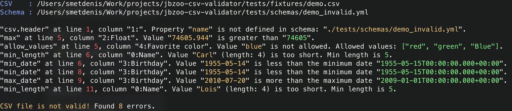

# JBZoo / CSV Blueprint

[](https://github.com/JBZoo/Csv-Blueprint/actions/workflows/main.yml?query=branch%3Amaster)    [](https://github.com/JBZoo/Csv-Blueprint/actions/workflows/demo.yml)    [](https://github.com/JBZoo/Csv-Blueprint/actions/workflows/release-docker.yml)    [](https://coveralls.io/github/JBZoo/Csv-Blueprint?branch=master)    [](https://shepherd.dev/github/JBZoo/Csv-Blueprint)    [](https://github.com/JBZoo/Csv-Blueprint/blob/master/LICENSE)    
[](https://github.com/jbzoo/csv-blueprint/releases)    [](https://packagist.org/packages/jbzoo/csv-blueprint/stats)    [](https://hub.docker.com/r/jbzoo/csv-blueprint/tags)    [](https://hub.docker.com/r/jbzoo/csv-blueprint/tags)

<!-- rules-counter -->
[](schema-examples/full.yml)    [](src/Rules/Cell)    [](src/Rules/Aggregate)    [](#extra-checks)    [](tests/schemas/todo.yml)
<!-- /rules-counter -->

A console utility designed for validating CSV files against a strictly defined schema and validation rules outlined
in [YAML files](#schema-definition) serves an essential purpose in ensuring data integrity and conformity.
This utility facilitates automated checks to verify that the structure and content of CSV files adhere to predefined
specifications, making it invaluable in scenarios where data quality and consistency are critical.

### Why?

* **Data Integration:** When integrating data from multiple sources, ensuring that incoming CSV files meet expected
  formats and data types.
* **Automated Data Pipelines:** In automated ETL processes, validating CSV files against a predefined schema can
  significantly reduce the risk of errors and data quality issues in downstream applications.
* **Data Quality Assurance:** Ensuring the quality of data before it enters analysis workflows or databases can save
  significant time and resources.
* **Development and Testing:** During software development, especially in applications that import or export CSV data,
  having a tool to validate test data ensures consistency and reliability of test cases.
* **Collaboration Across Teams:** By defining CSV formats and validation rules in YAML files, teams can share and
  collaborate on data specifications more easily, ensuring consistency across different parts of an organization.
  Documentation as code!


### Features

* **Schema-based Validation**: Define the structure and rules for your CSV files in an
  intuitive [YAML format](schema-examples/full.yml), enabling precise validation against your data's expected format.
* **Comprehensive Rule Set**: Includes a broad set of validation rules, such as non-empty fields, exact values, regular
  expressions, numeric constraints, date formats, and more, catering to various data validation needs.
* **Docker Support**: Easily integrate into any workflow with Docker, providing a seamless experience for development,
  testing, and production environments.
* **GitHub Actions Integration**: Automate CSV validation in your CI/CD pipeline, enhancing the quality control of your
  data in pull requests and deployments.
* **Various ways of reporting:** You can be easily integrated with GitHub, Gitlab, TeamCity, etc. The default
  output is a human-readable table. [See Live Demo](https://github.com/JBZoo/Csv-Blueprint-Demo).

### Live Demo

* As a live demonstration of how the tool works you can take a look at the super minimal repository - [JBZoo/Csv-Blueprint-Demo](https://github.com/JBZoo/Csv-Blueprint-Demo). Feel free to fork it and play with the tool.
* You can see more complex examples and different ways of reporting by looking at the [last Demo pipeline](https://github.com/JBZoo/Csv-Blueprint/actions/workflows/demo.yml) (please open the logs). There you'll find the basic ways to get started. And also the `All Report Types` (left sidebar) link with the different report types.

**See also**
* [PR as a live demo](https://github.com/JBZoo/Csv-Blueprint-Demo/pull/1/files)
* [.github/workflows/demo.yml](.github/workflows/demo.yml)
* [demo_invalid.yml](tests/schemas/demo_invalid.yml)
* [demo_valid.yml](tests/schemas/demo_valid.yml)
* [demo.csv](tests/fixtures/demo.csv)


## Schema definition
Define your CSV validation schema in a [YAML](schema-examples/full.yml). Other formats are also available: [JSON](schema-examples/full.json), [PHP](schema-examples/full.php).

This example defines a simple schema for a CSV file with a header row, specifying that the `id` column must not be empty and must contain integer values.
Also, it checks that the `name` column has a minimum length of 3 characters.

```yml
csv:
  delimiter: ;

columns:
  - name: id
    rules:
      not_empty: true
      is_int: true

  - name: name
    rules:
      min_length: 3

```


### Full description of the schema

In the [example Yml file](schema-examples/full.yml) you can find a detailed description of all features.
It's also covered by tests, so it's always up-to-date.

**Important notes**
* I have deliberately refused typing of columns (like `type: integer`) and replaced them with rules,
  which can be combined in any sequence and completely at your discretion.
  This gives you great flexibility when validating CSV files.
* All fields (unless explicitly stated otherwise) are optional, and you can choose not to declare them. Up to you.
* If you specify a wrong rule name, non-existent values (which are not in the example below) or a different variable 
  type for any of the options, you will get a schema validation error. At your own risk, you can use the `skip-schema`
  option to avoid seeing these errors and use your keys in the schema.


Below you'll find the full list of rules and a brief commentary and example for context.
This part of the readme is also covered by autotests, so these code are always up-to-date.

In any unclear situation, look into it first.

<!-- full-yml -->
```yml
# It's a complete example of the CSV schema file in YAML format.
# See copy of the file without comments here ./schema-examples/full_clean.yml

# Just meta
name: CSV Blueprint Schema Example      # Name of a CSV file. Not used in the validation process.
description: |                          # Any description of the CSV file. Not used in the validation process.
  This YAML file provides a detailed description and validation rules for CSV files
  to be processed by JBZoo/Csv-Blueprint tool. It includes specifications for file name patterns,
  CSV formatting options, and extensive validation criteria for individual columns and their values,
  supporting a wide range of data validation rules from basic type checks to complex regex validations.
  This example serves as a comprehensive guide for creating robust CSV file validations.


# Regular expression to match the file name. If not set, then no pattern check.
# This allows you to pre-validate the file name before processing its contents.
# Feel free to check parent directories as well.
# See https://www.php.net/manual/en/reference.pcre.pattern.syntax.php
filename_pattern: /demo(-\d+)?\.csv$/i


# Here are default values to parse CSV file.
# You can skip this section if you don't need to override the default values.
csv:
  header: true                          # If the first row is a header. If true, name of each column is required.
  delimiter: ,                          # Delimiter character in CSV file.
  quote_char: \                         # Quote character in CSV file.
  enclosure: '"'                        # Enclosure for each field in CSV file.
  encoding: utf-8                       # (Experimental) Only utf-8, utf-16, utf-32.
  bom: false                            # (Experimental) If the file has a BOM (Byte Order Mark) at the beginning.


# Description of each column in CSV.
# It is recommended to present each column in the same order as presented in the CSV file.
# This will not affect the validator, but will make it easier for you to navigate.
# For convenience, use the first line as a header (if possible).
columns:
  - name: Column Name (header)          # Any custom name of the column in the CSV file (first row). Required if "csv_structure.header" is true.
    description: Lorem ipsum            # Description of the column. Not used in the validation process.
    example: Some example               # Example of the column value. Schema will also check this value on its own.

    # Important notes about the validation rules.
    # 1. All rules except "not_empty" ignored for empty strings (length 0).
    #    If the value must be non-empty, use "not_empty" as extra rule!
    # 2. All rules don't depend on each other. They are independent.
    #    They know nothing about each other and cannot influence each other.
    # 3. You can use the rules in any combination. Or not use any of them.
    #    They are grouped below simply for ease of navigation and reading.
    # 4. If you see the value for the rule is "true" - that's just an enable flag.
    #    In other cases, these are rule parameters.
    # 5. The order of rules execution is the same as in the schema. But it doesn't matter.
    #    The result will be the same in any order.
    # 6. Most of the rules are case-sensitive. Unless otherwise specified.
    # 7. As backup plan, you always can use the "regex" rule. ON YOUR OWN RISK!

    ####################################################################################################################
    # Data validation for each(!) value in the column.
    # Every rule is optional.
    rules:
      # General rules
      not_empty: true                   # Value is not an empty string. Actually checks if the string length is not 0.
      exact_value: Some string          # Exact value for string in the column.
      allow_values: [ y, n, "" ]        # Strict set of values that are allowed.
      not_allow_values: [ invalid ]     # Strict set of values that are NOT allowed.

      # Any valid regex pattern. See https://www.php.net/manual/en/reference.pcre.pattern.syntax.php
      # Of course it's a super powerful tool to verify any sort of string data.
      # Please, be careful. Regex is a powerful tool, but it can be very dangerous if used incorrectly.
      # Remember that if you want to solve a problem with regex, you now have two problems.
      # But have it your way, then happy debugging! https://regex101.com
      regex: /^[\d]{2}$/

      # Checks length of a string including spaces (multibyte safe).
      length_min: 1                     # x >= 1
      length_greater: 2                 # x >  2
      length_not: 0                     # x != 0
      length: 7                         # x == 7
      length_less: 8                    # x <  8
      length_max: 9                     # x <= 9

      # Basic string checks
      is_trimmed: true                  # Only trimmed strings. Example: "Hello World" (not " Hello World ").
      is_lowercase: true                # String is only lower-case. Example: "hello world".
      is_uppercase: true                # String is only upper-case. Example: "HELLO WORLD".
      is_capitalize: true               # String is only capitalized. Example: "Hello World".

      # Count number of words used in a string
      # Note that multibyte locales are not supported.
      # Example: "Hello World, 123" - 2 words only (123 is not a word).
      word_count_min: 1                 # x >= 1
      word_count_greater: 2             # x >  2
      word_count_not: 0                 # x != 0
      word_count: 7                     # x == 7
      word_count_less: 8                # x <  8
      word_count_max: 9                 # x <= 9

      # Contains rules
      contains: World                   # Example: "Hello World!". The string must contain "World" in any place.
      contains_none: [ a, b ]           # All the strings must NOT be part of a CSV value.
      contains_one: [ a, b ]            # Only one of the strings must be part of the CSV value.
      contains_any: [ a, b ]            # At least one of the string must be part of the CSV value.
      contains_all: [ a, b ]            # All the strings must be part of a CSV value.
      starts_with: 'prefix '            # Example: "prefix Hello World".
      ends_with: ' suffix'              # Example: "Hello World suffix".

      # Under the hood it converts and compares as float values.
      # Comparison accuracy is 10 digits after a dot.
      # Scientific number format is also supported. Example: "1.2e3"
      num_min: 1.0                      # x >= 1.0
      num_greater: 2.0                  # x >  2.0
      num_not: 5.0                      # x != 5.0
      num: 7.0                          # x == 7.0
      num_less: 8.0                     # x <  8.0
      num_max: 9.0                      # x <= 9.0
      is_int: true                      # Check format only. Can be negative and positive. Without any separators.
      is_float: true                    # Check format only. Can be negative and positive. Dot as decimal separator.

      # Number of digits after the decimal point (with zeros)
      precision_min: 1                  # x >= 1
      precision_greater: 2              # x >  2
      precision_not: 0                  # x != 0
      precision: 7                      # x == 7
      precision_less: 8                 # x <  8
      precision_max: 9                  # x <= 9

      # Dates. Under the hood, the strings are converted to timestamp and compared.
      # This gives you the ability to use relative dates and any formatting you want.
      # By default, it works in UTC. But you can specify your own timezone as part of the date string.
      # Format:    https://www.php.net/manual/en/datetime.format.php
      # Parsing:   https://www.php.net/manual/en/function.strtotime.php
      # Timezones: https://www.php.net/manual/en/timezones.php
      date_min: -100 years              # Example of relative formats
      date_greater: -99 days            # Example of relative formats
      date_not: 2006-01-02 15:04:05 -0700 Europe/Rome
      date: 01 Jan 2000                 # You can use any string that can be parsed by the strtotime function
      date_less: now                    # Example of current date and time
      date_max: +1 day                  # Example of relative formats
      date_format: Y-m-d                # Check strict format of the date.
      is_date: true                     # Accepts arbitrary date format. Is shows error if failed to convert to timestamp.
      is_timezone: true                 # Allow only timezone identifiers. Case-insensitive. Example: "Europe/London", "utc".
      is_timezone_offset: true          # Allow only timezone offsets. Example: "+03:00".
      is_time: true                     # Check if the cell value is a valid time in the format "HH:MM:SS AM/PM" / "HH:MM:SS" / "HH:MM". Case-insensitive.
      is_leap_year: true                # Check if the cell value is a leap year. Example: "2008", "2008-02-29 23:59:59 UTC".

      # Specific formats
      is_bool: true                     # Allow only boolean values "true" and "false", case-insensitive.
      is_uuid: true                     # Validates whether the input is a valid UUID. It also supports validation of specific versions 1, 3, 4 and 5.
      is_slug: true                     # Only slug format. Example: "my-slug-123". It can contain letters, numbers, and dashes.
      is_currency_code: true            # Validates an ISO 4217 currency code like GBP or EUR. Case-sensitive. See: https://en.wikipedia.org/wiki/ISO_4217.
      is_base64: true                   # Validate if a string is Base64-encoded. Example: "cmVzcGVjdCE=".
      is_angle: true                    # Check if the cell value is a valid angle (0.0 to 360.0).

      # Internet
      is_ip: true                       # Both: IPv4 or IPv6.
      is_ip_v4: true                    # Only IPv4. Example: "127.0.0.1".
      is_ip_v6: true                    # Only IPv6. Example: "2001:0db8:85a3:08d3:1319:8a2e:0370:7334".
      is_ip_private: true               # IPv4 has ranges: 10.0.0.0/8, 172.16.0.0/12 and 192.168.0.0/16. IPv6 has ranges starting with FD or FC.
      is_ip_reserved: true              # IPv4 has ranges: 0.0.0.0/8, 169.254.0.0/16, 127.0.0.0/8 and 240.0.0.0/4. IPv6 has ranges: ::1/128, ::/128, ::ffff:0:0/96 and fe80::/10.
      ip_v4_range: [ '127.0.0.1-127.0.0.5', '127.0.0.0/21' ] # Check subnet mask or range for IPv4. Address must be in one of the ranges.
      is_mac_address: true              # The input is a valid MAC address. Example: 00:00:5e:00:53:01
      is_domain: true                   # Only domain name. Example: "example.com".
      is_public_domain_suffix: true     # The input is a public ICANN domain suffix. Example: "com", "nom.br", "net" etc.
      is_url: true                      # Only URL format. Example: "https://example.com/page?query=string#anchor".
      is_email: true                    # Only email format. Example: "user@example.com".

      # Validates if the given input is a valid JSON.
      # This is possible if you escape all special characters correctly and use a special CSV format.
      is_json: true                     # Example: {"foo":"bar"}.

      # Geography
      is_latitude: true                 # Can be integer or float. Example: 50.123456.
      is_longitude: true                # Can be integer or float. Example: -89.123456.
      is_geohash: true                  # Check if the value is a valid geohash. Example: "u4pruydqqvj".
      is_cardinal_direction: true       # Valid cardinal direction. Available values: ["N", "S", "E", "W", "NE", "SE", "NW", "SW", "none", ""]
      is_usa_market_name: true          # Check if the value is a valid USA market name. Example: "New York, NY".

      # Validates whether the input is a country code in ISO 3166-1 standard.
      # Available options: "alpha-2" (Ex: "US"), "alpha-3" (Ex: "USA"), "numeric" (Ex: "840").
      # The rule uses data from iso-codes: https://salsa.debian.org/iso-codes-team/iso-codes.
      is_country_code: alpha-2          # Country code in ISO 3166-1 standard. Examples: "US", "USA", "840"

      # Validates whether the input is language code based on ISO 639.
      # Available options: "alpha-2" (Ex: "en"), "alpha-3" (Ex: "eng").
      # See: https://en.wikipedia.org/wiki/ISO_639.
      is_language_code: alpha-2         # Examples: "en", "eng"

      # Filesystem (with IO!)
      is_file_exists: true              # Check if file exists on the filesystem (It's FS IO operation!).
      is_dir_exists: true               # Check if directory exists on the filesystem (It's FS IO operation!).

      # Mathematical
      is_fibonacci: true                # Validates whether the input follows the Fibonacci integer sequence. Example: "8", "13".
      is_prime_number: true             # Validates a prime number. Example: "3", "5", "7", "11".
      is_even: true                     # Check if the value is an even number. Example: "2", "4", "6".
      is_odd: true                      # Check if the value is an odd number. Example: "1", "7", "11".
      is_roman: true                    # Validates if the input is a Roman numeral. Example: "I", "IV", "XX".

      # Identifications
      phone: ALL                        # Validates if the input is a phone number. Specify the country code to validate the phone number for a specific country. Example: "ALL", "US", "BR".".

      # Misc
      is_version: true                  # Validates the string as version numbers using Semantic Versioning. Example: "1.2.3".
      is_punct: true                    # Validates whether the input composed by only punctuation characters. Example: "!@#$%^&*()".
      is_vowel: true                    # Validates whether the input contains only vowels. Example: "aei".
      is_consonant: true                # Validates if the input contains only consonants. Example: "bcd".
      is_alnum: true                    # Validates whether the input is only alphanumeric. Example: "aBc123".
      is_alpha: true                    # This is similar to `is_alnum`, but it does not allow numbers. Example: "aBc".

      # Check if the value is a valid hash. Supported algorithms:
      #  - md2, md4, md5, sha1, sha224, sha256, sha384, sha512/224, sha512/256, sha512
      #  - sha3-224, sha3-256, sha3-384, sha3-512, ripemd128, ripemd160, ripemd256, ripemd320, whirlpool, tiger128,3
      #  - tiger160,3, tiger192,3, tiger128,4, tiger160,4, tiger192,4, snefru, snefru256, gost, gost-crypto, adler32
      #  - crc32, crc32b, crc32c, fnv132, fnv1a32, fnv164, fnv1a64, joaat, murmur3a, murmur3c
      #  - murmur3f, xxh32, xxh64, xxh3, xxh128, haval128,3, haval160,3, haval192,3, haval224,3, haval256,3
      #  - haval128,4, haval160,4, haval192,4, haval224,4, haval256,4, haval128,5, haval160,5, haval192,5, haval224,5, haval256,5
      hash: set_algo                    # Example: "1234567890abcdef".


    ####################################################################################################################
    # Data validation for the entire(!) column using different data aggregation methods.
    # Every rule is optional.
    aggregate_rules:
      is_unique: true                   # All values in the column are unique.

      # Check if the column is sorted in a specific order.
      #  - Direction: ["asc", "desc"].
      #  - Method: ["natural", "regular", "numeric", "string"].
      # See: https://www.php.net/manual/en/function.sort.php
      sorted: [ asc, natural ]          # Expected ascending order, natural sorting.

      # First number in the column. Expected value is float or integer.
      first_num_min: 1.0                # x >= 1.0
      first_num_greater: 2.0            # x >  2.0
      first_num_not: 5.0                # x != 5.0
      first_num: 7.0                    # x == 7.0
      first_num_less: 8.0               # x <  8.0
      first_num_max: 9.0                # x <= 9.0
      first: Expected                   # First value in the column. Will be compared as strings.
      first_not: Not expected           # Not allowed as the first value in the column. Will be compared as strings.

      # N-th value in the column.
      # The rule expects exactly two arguments: the first is the line number (without header), the second is the expected value.
      # Example: `[ 42, 5.0 ]` On the line 42 (disregarding the header), we expect the 5.0. The comparison is always as float.
      nth_num_min: [ 42, 1.0 ]          # x >= 1.0
      nth_num_greater: [ 42, 2.0 ]      # x >  2.0
      nth_num_not: [ 42, 5.0 ]          # x != 5.0
      nth_num: [ 42, 7.0 ]              # x == 7.0
      nth_num_less: [ 42, 8.0 ]         # x <  8.0
      nth_num_max: [ 42, 9.0 ]          # x <= 9.0
      nth: [ 2, Expected ]              # Nth value in the column. Will be compared as strings.
      nth_not: [ 2, Not expected ]      # Not allowed as the N-th value in the column. Will be compared as strings.

      # Last number in the column. Expected value is float or integer.
      last_num_min: 1.0                 # x >= 1.0
      last_num_greater: 2.0             # x >  2.0
      last_num_not: 5.0                 # x != 5.0
      last_num: 7.0                     # x == 7.0
      last_num_less: 8.0                # x <  8.0
      last_num_max: 9.0                 # x <= 9.0
      last: Expected                    # Last value in the column. Will be compared as strings.
      last_not: Not expected            # Not allowed as the last value in the column. Will be compared as strings.

      # Sum of the numbers in the column. Example: [1, 2, 3] => 6.
      sum_min: 1.0                      # x >= 1.0
      sum_greater: 2.0                  # x >  2.0
      sum_not: 5.0                      # x != 5.0
      sum: 7.0                          # x == 7.0
      sum_less: 8.0                     # x <  8.0
      sum_max: 9.0                      # x <= 9.0

      # Regular the arithmetic mean. The sum of the numbers divided by the count.
      average_min: 1.0                  # x >= 1.0
      average_greater: 2.0              # x >  2.0
      average_not: 5.0                  # x != 5.0
      average: 7.0                      # x == 7.0
      average_less: 8.0                 # x <  8.0
      average_max: 9.0                  # x <= 9.0

      # Total number of rows in the CSV file.
      # Since any(!) values are taken into account, it only makes sense to use these rules once in any column.
      count_min: 1                      # x >= 1
      count_greater: 2                  # x >  2
      count_not: 0                      # x != 0
      count: 7                          # x == 7
      count_less: 8                     # x <  8
      count_max: 9                      # x <= 9

      # Counts only empty values (string length is 0).
      count_empty_min: 1                # x >= 1
      count_empty_greater: 2            # x >  2
      count_empty_not: 0                # x != 0
      count_empty: 7                    # x == 7
      count_empty_less: 8               # x <  8
      count_empty_max: 9                # x <= 9

      # Counts only not empty values (string length is not 0).
      count_not_empty_min: 1            # x >= 1
      count_not_empty_greater: 2        # x >  2
      count_not_empty_not: 0            # x != 0
      count_not_empty: 7                # x == 7
      count_not_empty_less: 8           # x <  8
      count_not_empty_max: 9            # x <= 9

      # Number of unique values.
      count_distinct_min: 1             # x >= 1
      count_distinct_greater: 2         # x >  2
      count_distinct_not: 0             # x != 0
      count_distinct: 7                 # x == 7
      count_distinct_less: 8            # x <  8
      count_distinct_max: 9             # x <= 9

      # Number of positive values.
      count_positive_min: 1             # x >= 1
      count_positive_greater: 2         # x >  2
      count_positive_not: 0             # x != 0
      count_positive: 7                 # x == 7
      count_positive_less: 8            # x <  8
      count_positive_max: 9             # x <= 9

      # Number of negative values.
      count_negative_min: 1             # x >= 1
      count_negative_greater: 2         # x >  2
      count_negative_not: 0             # x != 0
      count_negative: 7                 # x == 7
      count_negative_less: 8            # x <  8
      count_negative_max: 9             # x <= 9

      # Number of zero values. Any text and spaces (i.e. anything that doesn't look like a number) will be converted to 0.
      count_zero_min: 1                 # x >= 1
      count_zero_greater: 2             # x >  2
      count_zero_not: 0                 # x != 0
      count_zero: 7                     # x == 7
      count_zero_less: 8                # x <  8
      count_zero_max: 9                 # x <= 9

      # Number of even values.
      count_even_min: 1                 # x >= 1
      count_even_greater: 2             # x >  2
      count_even_not: 0                 # x != 0
      count_even: 7                     # x == 7
      count_even_less: 8                # x <  8
      count_even_max: 9                 # x <= 9

      # Number of odd values.
      count_odd_min: 1                  # x >= 1
      count_odd_greater: 2              # x >  2
      count_odd_not: 0                  # x != 0
      count_odd: 7                      # x == 7
      count_odd_less: 8                 # x <  8
      count_odd_max: 9                  # x <= 9

      # Number of prime values.
      count_prime_min: 1                # x >= 1
      count_prime_greater: 2            # x >  2
      count_prime_not: 0                # x != 0
      count_prime: 7                    # x == 7
      count_prime_less: 8               # x <  8
      count_prime_max: 9                # x <= 9

      # Calculate the median average of a list of numbers.
      # See: https://en.wikipedia.org/wiki/Median
      median_min: 1.0                   # x >= 1.0
      median_greater: 2.0               # x >  2.0
      median_not: 5.0                   # x != 5.0
      median: 7.0                       # x == 7.0
      median_less: 8.0                  # x <  8.0
      median_max: 9.0                   # x <= 9.0

      # Harmonic mean (subcontrary mean). The harmonic mean can be expressed as the reciprocal of the arithmetic mean of the reciprocals.
      # Appropriate for situations when the average of rates is desired.
      # See: https://en.wikipedia.org/wiki/Harmonic_mean
      harmonic_mean_min: 1.0            # x >= 1.0
      harmonic_mean_greater: 2.0        # x >  2.0
      harmonic_mean_not: 5.0            # x != 5.0
      harmonic_mean: 7.0                # x == 7.0
      harmonic_mean_less: 8.0           # x <  8.0
      harmonic_mean_max: 9.0            # x <= 9.0

      # Geometric mean. A type of mean which indicates the central tendency or typical value of a set of numbers
      # by using the product of their values (as opposed to the arithmetic mean which uses their sum).
      # See: https://en.wikipedia.org/wiki/Geometric_mean
      geometric_mean_min: 1.0           # x >= 1.0
      geometric_mean_greater: 2.0       # x >  2.0
      geometric_mean_not: 5.0           # x != 5.0
      geometric_mean: 7.0               # x == 7.0
      geometric_mean_less: 8.0          # x <  8.0
      geometric_mean_max: 9.0           # x <= 9.0

      # Contraharmonic mean. A function complementary to the harmonic mean. A special case of the Lehmer mean, L₂(x), where p = 2.
      # See: https://en.wikipedia.org/wiki/Contraharmonic_mean
      contraharmonic_mean_min: 1.0      # x >= 1.0
      contraharmonic_mean_greater: 2.0  # x >  2.0
      contraharmonic_mean_not: 5.0      # x != 5.0
      contraharmonic_mean: 7.0          # x == 7.0
      contraharmonic_mean_less: 8.0     # x <  8.0
      contraharmonic_mean_max: 9.0      # x <= 9.0

      # Root mean square (quadratic mean) The square root of the arithmetic mean of the squares of a set of numbers.
      # See https://en.wikipedia.org/wiki/Root_mean_square
      root_mean_square_min: 1.0         # x >= 1.0
      root_mean_square_greater: 2.0     # x >  2.0
      root_mean_square_not: 5.0         # x != 5.0
      root_mean_square: 7.0             # x == 7.0
      root_mean_square_less: 8.0        # x <  8.0
      root_mean_square_max: 9.0         # x <= 9.0

      # Trimean (TM, or Tukey's trimean).
      # A measure of a probability distribution's location defined as a weighted average of the distribution's median and its two quartiles.
      # See: https://en.wikipedia.org/wiki/Trimean
      trimean_min: 1.0                  # x >= 1.0
      trimean_greater: 2.0              # x >  2.0
      trimean_not: 5.0                  # x != 5.0
      trimean: 7.0                      # x == 7.0
      trimean_less: 8.0                 # x <  8.0
      trimean_max: 9.0                  # x <= 9.0

      # Cubic mean. See: https://en.wikipedia.org/wiki/Cubic_mean
      cubic_mean_min: 1.0               # x >= 1.0
      cubic_mean_greater: 2.0           # x >  2.0
      cubic_mean_not: 5.0               # x != 5.0
      cubic_mean: 7.0                   # x == 7.0
      cubic_mean_less: 8.0              # x <  8.0
      cubic_mean_max: 9.0               # x <= 9.0

      # Compute the P-th percentile of a list of numbers.
      # Linear interpolation between closest ranks method - Second variant, C = 1 P-th percentile (0 <= P <= 100) of a list of N ordered values (sorted from least to greatest).
      # Similar method used in NumPy and Excel.
      # See: https://en.wikipedia.org/wiki/Percentile#Second_variant.2C_.7F.27.22.60UNIQ--postMath-00000043-QINU.60.22.27.7F
      # Example: `[ 95.5, 1.234 ]` The 95.5th percentile in the column must be "1.234" (float).
      percentile_min: [ 95.0, 1.0 ]     # x >= 1.0
      percentile_greater: [ 95.0, 2.0 ] # x >  2.0
      percentile_not: [ 95.0, 5.0 ]     # x != 5.0
      percentile: [ 95.0, 7.0 ]         # x == 7.0
      percentile_less: [ 95.0, 8.0 ]    # x <  8.0
      percentile_max: [ 95.0, 9.0 ]     # x <= 9.0

      # Quartiles. Three points that divide the data set into four equal groups, each group comprising a quarter of the data.
      # See: https://en.wikipedia.org/wiki/Quartile
      # There are multiple methods for computing quartiles: ["exclusive", "inclusive"]. Exclusive is ussually classic.
      # Available types: ["0%", "Q1", "Q2", "Q3", "100%", "IQR"] ("IQR" is Interquartile Range)
      # Example: `[ inclusive, 'Q3', 42.0 ]` - the Q3 inclusive quartile is 42.0
      quartiles_min: [ exclusive, '0%', 1.0 ]               # x >= 1.0
      quartiles_greater: [ inclusive, 'Q1', 2.0 ]           # x >  2.0
      quartiles_not: [ exclusive, 'Q2', 5.0 ]               # x != 5.0
      quartiles: [ inclusive, 'Q3', 7.0 ]                   # x == 7.0
      quartiles_less: [ exclusive, '100%', 8.0 ]            # x <  8.0
      quartiles_max: [ inclusive, 'IQR', 9.0 ]              # x <= 9.0

      # Midhinge. The average of the first and third quartiles and is thus a measure of location.
      # Equivalently, it is the 25% trimmed mid-range or 25% midsummary; it is an L-estimator.
      # See: https://en.wikipedia.org/wiki/Midhinge
      # Midhinge = (first quartile, third quartile) / 2
      midhinge_min: 1.0                 # x >= 1.0
      midhinge_greater: 2.0             # x >  2.0
      midhinge_not: 5.0                 # x != 5.0
      midhinge: 7.0                     # x == 7.0
      midhinge_less: 8.0                # x <  8.0
      midhinge_max: 9.0                 # x <= 9.0

      # MAD - mean absolute deviation. The average of the absolute deviations from a central point.
      # It is a summary statistic of statistical dispersion or variability.
      # See: https://en.wikipedia.org/wiki/Average_absolute_deviation
      mean_abs_dev_min: 1.0             # x >= 1.0
      mean_abs_dev_greater: 2.0         # x >  2.0
      mean_abs_dev_not: 5.0             # x != 5.0
      mean_abs_dev: 7.0                 # x == 7.0
      mean_abs_dev_less: 8.0            # x <  8.0
      mean_abs_dev_max: 9.0             # x <= 9.0

      # MAD - median absolute deviation. The average of the absolute deviations from a central point.
      # It is a summary statistic of statistical dispersion or variability.
      # It is a robust measure of the variability of a univariate sample of quantitative data.
      # See: https://en.wikipedia.org/wiki/Median_absolute_deviation
      median_abs_dev_min: 1.0           # x >= 1.0
      median_abs_dev_greater: 2.0       # x >  2.0
      median_abs_dev_not: 5.0           # x != 5.0
      median_abs_dev: 7.0               # x == 7.0
      median_abs_dev_less: 8.0          # x <  8.0
      median_abs_dev_max: 9.0           # x <= 9.0

      # Population variance - Use when all possible observations of the system are present.
      # If used with a subset of data (sample variance), it will be a biased variance.
      # n degrees of freedom, where n is the number of observations.
      population_variance_min: 1.0      # x >= 1.0
      population_variance_greater: 2.0  # x >  2.0
      population_variance_not: 5.0      # x != 5.0
      population_variance: 7.0          # x == 7.0
      population_variance_less: 8.0     # x <  8.0
      population_variance_max: 9.0      # x <= 9.0

      # Unbiased sample variance Use when only a subset of all possible observations of the system are present.
      # n - 1 degrees of freedom, where n is the number of observations.
      sample_variance_min: 1.0          # x >= 1.0
      sample_variance_greater: 2.0      # x >  2.0
      sample_variance_not: 5.0          # x != 5.0
      sample_variance: 7.0              # x == 7.0
      sample_variance_less: 8.0         # x <  8.0
      sample_variance_max: 9.0          # x <= 9.0

      # Standard deviation (For a sample; uses sample variance). It also known as SD or StdDev.
      # StdDev is a measure that is used to quantify the amount of variation or dispersion of a set of data values.
      #  - Low standard deviation indicates that the data points tend to be close to the mean (also called the expected value) of the set.
      #  - High standard deviation indicates that the data points are spread out over a wider range of values.
      # See: https://en.wikipedia.org/wiki/Standard_deviation
      stddev_min: 1.0                   # x >= 1.0
      stddev_greater: 2.0               # x >  2.0
      stddev_not: 5.0                   # x != 5.0
      stddev: 7.0                       # x == 7.0
      stddev_less: 8.0                  # x <  8.0
      stddev_max: 9.0                   # x <= 9.0

      # SD+ (Standard deviation for a population; uses population variance)
      stddev_pop_min: 1.0               # x >= 1.0
      stddev_pop_greater: 2.0           # x >  2.0
      stddev_pop_not: 5.0               # x != 5.0
      stddev_pop: 7.0                   # x == 7.0
      stddev_pop_less: 8.0              # x <  8.0
      stddev_pop_max: 9.0               # x <= 9.0

      # Coefficient of variation (cᵥ) Also known as relative standard deviation (RSD)
      # A standardized measure of dispersion of a probability distribution or frequency distribution.
      # It is often expressed as a percentage. The ratio of the standard deviation to the mean.
      # See: https://en.wikipedia.org/wiki/Coefficient_of_variation
      coef_of_var_min: 1.0              # x >= 1.0
      coef_of_var_greater: 2.0          # x >  2.0
      coef_of_var_not: 5.0              # x != 5.0
      coef_of_var: 7.0                  # x == 7.0
      coef_of_var_less: 8.0             # x <  8.0
      coef_of_var_max: 9.0              # x <= 9.0

      # Interquartile mean (IQM). A measure of central tendency based on the truncated mean of the interquartile range.
      # Only the data in the second and third quartiles is used (as in the interquartile range), and the lowest 25% and the highest 25% of the scores are discarded.
      # See: https://en.wikipedia.org/wiki/Interquartile_mean
      # Note: It's SUPER slow!!!
      interquartile_mean_min: 1.0       # x >= 1.0
      interquartile_mean_greater: 2.0   # x >  2.0
      interquartile_mean_not: 5.0       # x != 5.0
      interquartile_mean: 7.0           # x == 7.0
      interquartile_mean_less: 8.0      # x <  8.0
      interquartile_mean_max: 9.0       # x <= 9.0

  - name: another_column
    rules:
      not_empty: true

  - name: third_column
    rules:
      not_empty: true

```
<!-- /full-yml -->


### Extra checks

Behind the scenes to what is outlined in the yml above, there are additional checks that will examine your files by default.

<!-- extra-rules -->

* With `filename_pattern` rule, you can check if the file name matches the pattern.
* Property `name` is not defined in a column. If `csv.header: true`.
* Check that each row matches the number of columns.
* If `csv.header: true`. Schema contains an unknown column `name` that is not found in the CSV file.
* If `csv.header: false`. Compare the number of columns in the schema and the CSV file.

<!-- /extra-rules -->


## Usage

You can find launch examples in the [workflow demo](https://github.com/JBZoo/Csv-Blueprint/actions/workflows/demo.yml).


### GitHub Action

<!-- github-actions-yml -->
```yml
- uses: jbzoo/csv-blueprint@master # See the specific version on releases page
  with:
    # Path(s) to validate. You can specify path in which CSV files will be searched. Feel free to use glob pattrens. Usage examples: /full/path/file.csv, p/file.csv, p/*.csv, p/**/*.csv, p/**/name-*.csv, **/*.csv, etc.
    # Required: true
    csv: './tests/**/*.csv'

    # Schema filepath. It can be a YAML, JSON or PHP. See examples on GitHub.
    # Required: true
    schema: './tests/**/*.yml'

    # Report format. Available options: text, table, github, gitlab, teamcity, junit.
    # Default value: table
    # You can skip it
    report: table

    # Quick mode. It will not validate all rows. It will stop after the first error.
    # Default value: no
    # You can skip it
    quick: no

    # Skip schema validation. If you are sure that the schema is correct, you can skip this check.
    # Default value: no
    # You can skip it
    skip-schema: no

```
<!-- /github-actions-yml -->

**Note**. GitHub Actions report format is `table` by default.

But you can specify `report: github` to see friendly error output in your PRs using [annotations](https://docs.github.com/en/actions/using-workflows/workflow-commands-for-github-actions#setting-a-warning-message).
This allows you to see bugs in the GitHub interface at the PR level. See [the PR as a live demo](https://github.com/JBZoo/Csv-Blueprint-Demo/pull/1/files).
That is, the error will be shown in a specific place in the CSV file right in diff of your Pull Requests!


<details>
  <summary>Click to see example in GitHub Actions terminal</summary>

  

</details>


### Docker container
Ensure you have Docker installed on your machine.

```sh
# Pull the Docker image
docker pull jbzoo/csv-blueprint:latest

# Run the tool inside Docker
docker run --rm                                  \
    --workdir=/parent-host                       \
    -v $(pwd):/parent-host                       \
    jbzoo/csv-blueprint:latest                   \
    validate:csv                                 \
    --csv=./tests/fixtures/demo.csv              \
    --schema=./tests/schemas/demo_invalid.yml    \
    --ansi -vvv


# OR build it from source.
git clone git@github.com:JBZoo/Csv-Blueprint.git csv-blueprint
cd csv-blueprint
make docker-build  # local tag is "jbzoo/csv-blueprint:local"
```


### PHP binary
Ensure you have PHP installed on your machine.

```sh
# download the latest version

wget https://github.com/JBZoo/Csv-Blueprint/releases/latest/download/csv-blueprint.phar
chmod +x ./csv-blueprint.phar
./csv-blueprint.phar validate:csv               \
   --csv=./tests/fixtures/demo.csv              \
   --schema=./tests/schemas/demo_invalid.yml


# OR build from source
git clone git@github.com:jbzoo/csv-blueprint.git csv-blueprint
cd csv-blueprint 
make build
./csv-blueprint validate:csv                    \
    --csv=./tests/fixtures/demo.csv             \
    --schema=./tests/schemas/demo_invalid.yml
```


## Complete CLI Help Message

Here you can see all available options and commands.  Tool uses [JBZoo/Cli](https://github.com/JBZoo/Cli) package for the CLI interface.
So there are options here for all occasions.


<!-- validate-csv-help -->
```
./csv-blueprint validate:csv --help


Description:
  Validate CSV file(s) by schema.

Usage:
  validate:csv [options]

Options:
  -c, --csv=CSV                    Path(s) to validate.
                                   You can specify path in which CSV files will be searched (max depth is 10).
                                   Feel free to use glob pattrens. Usage examples:
                                   /full/path/file.csv, p/file.csv, p/*.csv, p/**/*.csv, p/**/name-*.csv, **/*.csv, etc. (multiple values allowed)
  -s, --schema=SCHEMA              Path(s) to schema file(s).
                                   It can be a YAML, JSON or PHP. See examples on GitHub.Also, you can specify path in which schema files will be searched (max depth is 10).
                                   Feel free to use glob pattrens. Usage examples:
                                   /full/path/file.yml, p/file.yml, p/*.yml, p/**/*.yml, p/**/name-*.json, **/*.php, etc. (multiple values allowed)
  -r, --report=REPORT              Report output format. Available options:
                                   ["text", "table", "github", "gitlab", "teamcity", "junit"] [default: "table"]
  -Q, --quick[=QUICK]              Immediately terminate the check at the first error found.
                                   Of course it will speed up the check, but you will get only 1 message out of many.
                                   If any error is detected, the utility will return a non-zero exit code.
                                   Empty value or "yes" will be treated as "true". [default: "no"]
  -S, --skip-schema[=SKIP-SCHEMA]  Skip schema validation.
                                   If you are sure that the schema is correct, you can skip this check.
                                   Empty value or "yes" will be treated as "true". [default: "no"]
      --debug                      It's ONLY for debugging and advanced profiling!
      --no-progress                Disable progress bar animation for logs. It will be used only for text output format.
      --mute-errors                Mute any sort of errors. So exit code will be always "0" (if it's possible).
                                   It has major priority then --non-zero-on-error. It's on your own risk!
      --stdout-only                For any errors messages application will use StdOut instead of StdErr. It's on your own risk!
      --non-zero-on-error          None-zero exit code on any StdErr message.
      --timestamp                  Show timestamp at the beginning of each message.It will be used only for text output format.
      --profile                    Display timing and memory usage information.
      --output-mode=OUTPUT-MODE    Output format. Available options:
                                   text - Default text output format, userfriendly and easy to read.
                                   cron - Shortcut for crontab. It's basically focused on human-readable logs output.
                                   It's combination of --timestamp --profile --stdout-only --no-progress -vv.
                                   logstash - Logstash output format, for integration with ELK stack.
                                    [default: "text"]
      --cron                       Alias for --output-mode=cron. Deprecated!
  -h, --help                       Display help for the given command. When no command is given display help for the list command
  -q, --quiet                      Do not output any message
  -V, --version                    Display this application version
      --ansi|--no-ansi             Force (or disable --no-ansi) ANSI output
  -n, --no-interaction             Do not ask any interactive question
  -v|vv|vvv, --verbose             Increase the verbosity of messages: 1 for normal output, 2 for more verbose output and 3 for debug

```
<!-- /validate-csv-help -->


## Report examples

As a result of the validation process, you will receive a human-readable table with a list of errors found in the CSV file. By defualt, the output format is a table, but you can choose from a variety of formats, such as text, GitHub, GitLab, TeamCity, JUnit, and more.  For example, the following output is generated using the `table` format.

Default report format is `table`:

<!-- output-table -->
```
./csv-blueprint validate:csv --csv='./tests/fixtures/demo.csv' --schema='./tests/schemas/demo_invalid.yml'


CSV Blueprint: vX.Y.Z
Found Schemas   : 1
Found CSV files : 1
Pairs by pattern: 1

Check schema syntax: 1
(1/1) Schema: ./tests/schemas/demo_invalid.yml
(1/1) Issues: 2
+-------+------------------+--------------+----- demo_invalid.yml -----------------------------------------------+
| Line  | id:Column        | Rule         | Message                                                              |
+-------+------------------+--------------+----------------------------------------------------------------------+
| undef | 2:Float          | is_float     | Value "Qwerty" is not a float number                                 |
| undef | 4:Favorite color | allow_values | Value "123" is not allowed. Allowed values: ["red", "green", "Blue"] |
+-------+------------------+--------------+----- demo_invalid.yml -----------------------------------------------+


CSV file validation: 1
(1/1) Schema: ./tests/schemas/demo_invalid.yml
(1/1) CSV   : ./tests/fixtures/demo.csv; Size: 123.34 MB
(1/1) Issues: 10
+------+------------------+--------------+------------------------- demo.csv -------------------------------------------------------------------+
| Line | id:Column        | Rule         | Message                                                                                              |
+------+------------------+--------------+------------------------------------------------------------------------------------------------------+
| 1    |                  | csv.header   | Columns not found in CSV: "wrong_column_name"                                                        |
| 6    | 0:Name           | length_min   | The length of the value "Carl" is 4, which is less than the expected "5"                             |
| 11   | 0:Name           | length_min   | The length of the value "Lois" is 4, which is less than the expected "5"                             |
| 1    | 1:City           | ag:is_unique | Column has non-unique values. Unique: 9, total: 10                                                   |
| 2    | 2:Float          | num_max      | The value "4825.185" is greater than the expected "4825.184"                                         |
| 1    | 2:Float          | ag:nth_num   | The N-th value in the column is "74", which is not equal than the expected "0.001"                   |
| 6    | 3:Birthday       | date_min     | The date of the value "1955-05-14" is parsed as "1955-05-14 00:00:00 +00:00", which is less than the |
|      |                  |              | expected "1955-05-15 00:00:00 +00:00 (1955-05-15)"                                                   |
| 8    | 3:Birthday       | date_min     | The date of the value "1955-05-14" is parsed as "1955-05-14 00:00:00 +00:00", which is less than the |
|      |                  |              | expected "1955-05-15 00:00:00 +00:00 (1955-05-15)"                                                   |
| 9    | 3:Birthday       | date_max     | The date of the value "2010-07-20" is parsed as "2010-07-20 00:00:00 +00:00", which is greater than  |
|      |                  |              | the expected "2009-01-01 00:00:00 +00:00 (2009-01-01)"                                               |
| 5    | 4:Favorite color | allow_values | Value "blue" is not allowed. Allowed values: ["red", "green", "Blue"]                                |
+------+------------------+--------------+------------------------- demo.csv -------------------------------------------------------------------+


Summary:
  1 pairs (schema to csv) were found based on `filename_pattern`.
  Found 2 issues in 1 schemas.
  Found 10 issues in 1 out of 1 CSV files.


```
<!-- /output-table -->


Optional format `text` with highlited keywords:
```sh
./csv-blueprint validate:csv --report=text
```





**Notes**
* Report format for GitHub Actions is `table` by default.
* Tools uses [JBZoo/CI-Report-Converter](https://github.com/JBZoo/CI-Report-Converter) as SDK to convert reports to different formats. So you can easily integrate it with any CI system.


## Coming soon

It's random ideas and plans. No orderings and deadlines. <u>But batch processing is the priority #1</u>.

* **Batch processing**
  * If option `--csv` is not specified, then the STDIN is used. To build a pipeline in Unix-like systems.
  * Flag to ignore file name pattern. It's useful when you have a lot of files, and you don't want to validate the file name.

* **Validation**
  * `required` flag for the column.
  * Multi values in one cell.
  * Custom cell rule as a callback. It's useful when you have a complex rule that can't be described in the schema file.
  * Custom agregate rule as a callback. It's useful when you have a complex rule that can't be described in the schema file.
  * Configurable keyword for null/empty values. By default, it's an empty string. But you will use `null`, `nil`, `none`, `empty`, etc. Overridable on the column level.
  * Handle empty files and files with only a header row, or only with one line of data. One column wthout header is also possible.
  * Inheritance of schemas, rules and columns. Define parent schema and override some rules in the child schemas. Make it DRY and easy to maintain.
  * If option `--schema` is not specified, then validate only super base level things (like "is it a CSV file?").
  * Complex rules (like "if field `A` is not empty, then field `B` should be not empty too").
  * Extending with custom rules and custom report formats. Plugins?
  * Input encoding detection + `BOM` (right now it's experimental). It works but not so accurate... UTF-8/16/32 is the best choice for now.

* **Performance and optimization**
  * Benchmarks as part of the CI(?) and Readme. It's important to know how much time the validation process takes.
  * Parallel validation of really-really large files (1GB+ ?). I know you have them and not so much memory.
  * Parallel validation of multiple files at once.

* **Mock data generation**
  * Create CSV files based on the schema (like "create 1000 rows with random data based on schema and rules").
  * Use [Faker](https://github.com/FakerPHP/Faker) for random data generation.
  * [ReverseRegex](https://github.com/enso-media/ReverseRegex) to generate text from regex.

* **Reporting**
  * More report formats (like JSON, XML, etc). Any ideas?
  * Gitlab and JUnit reports must be as one structure. It's not so easy to implement. But it's a good idea.
  * Merge reports from multiple CSV files into one report. It's useful when you have a lot of files and you want to see all errors in one place. Especially for GitLab and JUnit reports.

* **Misc**
  * Use it as PHP SDK. Examples in Readme.
  * Warnings about deprecated options and features.
  * Add option `--recomendation` to show a list of recommended rules for the schema or potential issues in the CSV file or schema. It's useful when you are not sure what rules to use.
  * Add option `--error=[level]` to show only errors with a specific level. It's useful when you have a lot of warnings and you want to see only errors. 
  * S3 Storage support. Validate files in the S3 bucket? Hmm... Why not? But...
  * More examples and documentation.

 
PS. [There is a file](tests/schemas/todo.yml) with my ideas and imagination. It's not valid schema file, just a draft.
I'm not sure if I will implement all of them. But I will try to do my best.


## Disadvantages?

It is perceived that PHP is a slow language. I don't agree with that. You just need to know how to prepare it.
See [Processing One Billion CSV rows in PHP!](https://dev.to/realflowcontrol/processing-one-billion-rows-in-php-3eg0).
That is, if you do everything right, you can read, aggregate and calculate data from CSV at **~15 million lines per second**!

* Yeah-yeah. I know it's not the fastest tool in the world. But it's not the slowest either. See link above.
* Yeah-yeah. I know it's PHP (not Python, Go, PySpark...). PHP is not the best language for such tasks.
* Yeah-yeah. It looks like a standalone binary. Right. Just use it, don't think about how it works.
* Yeah-yeah. I know you can't use as Python SDK as part of a pipeline.

But... it's not a problem for most cases. And it solves the problem of validating CSV files in CI. 👍

The utility is made to just pick up and use and not think about how it works internally.
Moreover, everything is covered as strictly as possible by tests, strict typing of variables + `~7` linters and static analyzers (max level of rules). 
Also, if you look, you'll see that any PR goes through about `~10` different checks on GitHub Actions (matrix of PHP versions and mods).
Since I don't know under what conditions the code will be used, everything I can think of is covered. The wonderful world of Open Source.

So... as strictly as possible in today's PHP world. I think it works as expected.


## Interesting fact

I've set a personal record. The first version was written from scratch in about 3 days (with really frequent breaks to take care of 4 month baby).
I'm looking at the first commit and the very first git tag. I'd say over the weekend, in my spare time on my personal laptop.
Well... AI was only used for this Readme file because I'm not very good at English. 🤔

I seem to be typing fast and I had really great inspiration. I hope my wife doesn't divorce me. 😅


## Contributing
If you have any ideas or suggestions, feel free to open an issue or create a pull request.

```sh
# Fork the repo and build project
git clone git@github.com:jbzoo/csv-blueprint.git ./jbzoo-csv-blueprint
cd ./jbzoo-csv-blueprint
make build

# Make your local changes

# Autofix code style 
make test-phpcsfixer-fix test-phpcs

# Run all tests and check code style
make test
make codestyle

# Create your pull request and check all tests in CI (Github Actions)
# ???
# Profit!
```


## License

[MIT License](LICENSE): It's like free pizza - enjoy it, share it, just don't sell it as your own. And remember, no warranty for stomach aches! 😅


## See Also

- [Cli](https://github.com/JBZoo/Cli) - Framework helps create complex CLI apps and provides new tools for Symfony/Console.
- [CI-Report-Converter](https://github.com/JBZoo/CI-Report-Converter) - It converts different error reporting standards for popular CI systems.
- [Composer-Diff](https://github.com/JBZoo/Composer-Diff) - See what packages have changed after `composer update`.
- [Composer-Graph](https://github.com/JBZoo/Composer-Graph) - Dependency graph visualization of `composer.json` based on [Mermaid JS](https://mermaid.js.org/).
- [Mermaid-PHP](https://github.com/JBZoo/Mermaid-PHP) - Generate diagrams and flowcharts with the help of the [mermaid](https://mermaid.js.org/) script language.
- [Utils](https://github.com/JBZoo/Utils) - Collection of useful PHP functions, mini-classes, and snippets for every day.
- [Image](https://github.com/JBZoo/Image) - Package provides object-oriented way to manipulate with images as simple as possible.
- [Data](https://github.com/JBZoo/Data) - Extended implementation of ArrayObject. Use Yml/PHP/JSON/INI files as config. Forget about arrays.
- [Retry](https://github.com/JBZoo/Retry) - Tiny PHP library providing retry/backoff functionality with strategies and jitter.
